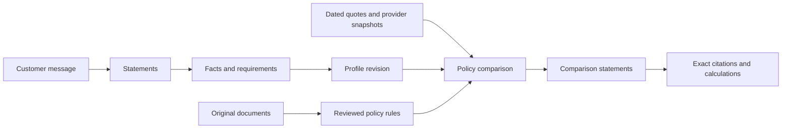

# Final CoverGuide database proposal for human review

Revision: `discussion-r26-neutral-comparison`
Status: revision `discussion-r26-neutral-comparison` incorporates the locally implemented neutral-comparison and route-pinning amendments. Production deployment and cutover remain unapproved.

## What is proposed

CoverGuide uses two physically separate databases:

1. The **application database** has **63 custom models, 601 fields, 170 typed relationships and 31 closed JSON contracts**. It supports customer conversations, facts and requirements, original policy evidence, structured policy rules, quotes/network observations, pinned interactive model routes and cited buying comparisons.
2. The **independent benchmark database** has **24 models and 296 fields**. It protects evaluation questions, expected answers, independent rule denominators and detailed scores from the application and implementers.

Django's standard authentication support tables still exist physically, but they are framework-managed and are not custom CoverGuide models. `Account` is an `AbstractUser` subclass with email as `USERNAME_FIELD`; reusable UUID and timestamp abstract bases do not create tables.

## Main information flow

Unstructured customer text is never discarded after extracting familiar facts. Each meaningful statement is classified and either mapped, left for clarification or ignored with a reason. Facts and requirements are versioned by logical key, so a correction does not silently rewrite an earlier answer.

Original policy data follows a separate chain: autonomous Codex discovery session → observed URL → capture attempt → exact preserved bytes → document edition → page and evidence span → policy version and structured rule. Search chunks improve recall; mandatory rule graphs, definitions, exceptions and source evidence determine the result.

## Scope decisions from the final audit

- Removed `AIPreference`. Customers do not choose the model route; only qualified system `ModelRoute` records control Codex/CLIProxyAPI calls.
- Added `TurnRouteBinding` and `Turn.route_commitment`. Both interactive routes are resolved before enqueue and pinned to exact passed qualifications, identities, endpoint/configuration hashes and schemas. Workers and retries never re-resolve mutable settings.
- Removed `PolicyEvent`. Existing-policy terms, dates and continuity remain available through `CustomerPolicyRevision`, `CustomerPolicyFact` and sourced `CustomerFact` records. Customer claim/payment/cancellation/refund workflows are outside scope.
- Removed duplicate `Message.turn_id`; `Turn.input_message_id` is authoritative.
- Renamed the turn's profile link to optional `starting_profile_revision_id`. A first turn has no earlier profile, and the resulting `Comparison.profile_revision_id` identifies what was actually evaluated.
- Replaced guessable hashes of private messages, selections and requests with keyed commitments. Stored response/result checksums cover encrypted bytes.
- Restricted customer-upload categories to offers, quotes, schedules, endorsements and member certificates needed for buying/comparison.
- Required contractual `PolicyVersionDocument` roles to come from insurer or regulator authority; independent comparisons may assist discovery but cannot become contractual evidence.
- Corrected `ConsentRecord.status` so its `requested` default is an explicit non-grant lifecycle state. Only an actual captured customer action may create a `granted` state.

## How a comparison is reproduced

A saved `Comparison` identifies one `AdviceRequest`, final `CustomerProfileRevision`, published `KnowledgeRelease` and processing `Turn`. Every reviewed product has a `PolicyComparisonAssessment`; each customer criterion has a `PolicyRequirementMatch`; missing material information becomes an `InformationNeed`; every customer-facing proposition is a `ComparisonStatement` with exact `ComparisonCitation` rows. `Calculation` stores typed inputs, ordered operations, assumptions and explicit unknown or blocked results. Products remain in stable insurer, product, UIN, and variant order regardless of criterion outcomes.

This preserves the difference among zero, unlimited, unknown and not applicable. It also keeps per-person, family, claim, policy-year and lifetime limits distinct inside the rule/calculation contracts, without creating customer claim records.

## Independent acceptance

The benchmark store freezes exactly 200 evaluation cases across 20 families, ten per family and at least four compound cases per family, plus 60 robustness checks and one complete independent rule inventory for each of 20 insurers. Every family contains buyer/comparison decisions; correction, clarification, reconnect and privacy behavior is tested within those decisions.

A complete campaign has 600 attempts: three fresh attempts for every case. A case passes only if all three attempts pass. Acceptance requires at least 180/200 overall and 9/10 in every family, at least 90% independently inventoried rule coverage overall and for each insurer, all 60 robustness checks, no blocking critical error, and all journey/engineering/performance/migration gates. A passing report permits only a later cutover discussion.

## Evidence and scenario status

The 400 scenario assessment records and their generalized field mappings are preserved. They are sufficient to explain why the proposed information is needed, but they do not prove that all 400 customer decisions are complete or that the adviser passes them. Out-of-scope claim-administration or servicing cases must be replaced by substantively distinct original-backed buyer/comparison cases before the independent cohort is frozen.

The preserved source corpus and reconciliation records remain research evidence. Exact historical document bundles, complete page/table/figure/footnote inventories and independently established atomic rule denominators are still unfinished. Therefore current knowledge coverage is unmeasured. Missing originals remain explicit gaps and cannot be converted into invented policy answers.

## Review files

- [Simple model guide](SIMPLE_DATABASE_REVIEW_GUIDE.md)
- [All models](entity-catalogue.md)
- [Every application field](field-dictionary.md)
- [Complete application ERD](complete-entity-relationships.mmd)
- [Independent benchmark design](benchmark-storage-proposal.md)
- [Final critical audit](final-critical-audit-r25.md)
- [Case-to-field map](case-requirement-field-map.json)
- [Migration map](migration-field-map.json)

The approved local implementation may proceed. Production consent policy, provider-retention verification, deployment and cutover remain separate gates; any later material schema change returns to discussion.
