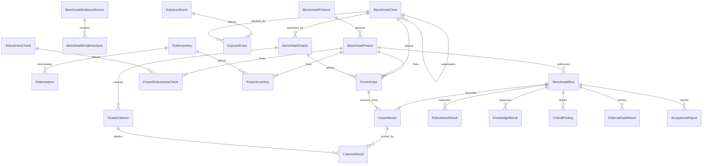

# Independent benchmark database — approved Batch 17 proposal

Revision: `discussion-r24`  
Status: approved for inclusion in the complete database-design review; no service, database, freeze or benchmark run exists yet.

This database is separate from the CoverGuide application. It protects the 200 evaluation questions, their expected answers, independent insurer-rule inventory and detailed scores so that the adviser cannot learn the test. It contains **24 models, 296 fields and 12 closed payload contracts**.

## Why a separate database is required

The application database is visible to the code and retrieval systems being tested. Storing private evaluation questions or expected answers there would contaminate the assessment. The independent service therefore uses its own database, encrypted object storage, credentials, keys, queue, logs and backups. Implementation identities cannot administer or read them. The candidate receives only the current synthetic question and conversation step.

External identity management supplies custodian, assessor, executor and scorer identities. This schema records their stable external subjects on actions, rather than rebuilding users, roles and permissions. Protected content is stored in typed encrypted objects owned by the relevant record; there is no catch-all artifact table.

## Model map

| Model | Simple purpose | Fields |
|---|---|---:|
| `BenchmarkProtocol` | Freezes the acceptance numbers and evaluation procedure before results are seen. | 24 |
| `BenchmarkEvidenceSource` | Registers an original document used by independent assessors. | 13 |
| `BenchmarkEvidenceSpan` | Points to the exact passage supporting an independently established rule or expected answer. | 11 |
| `BenchmarkCase` | Versions one protected customer buying/comparison scenario. | 18 |
| `BenchmarkOracle` | Versions the independently established expected outcome for one exact case version. | 15 |
| `OracleCriterion` | Stores one observable pass condition for an oracle. | 11 |
| `ExposureEvent` | Records actual or possible disclosure of protected benchmark content. | 13 |
| `ExposedCase` | Connects one exposure to every conservatively affected case version. | 8 |
| `RobustnessCheck` | Versions one independently authored non-advice robustness check. | 12 |
| `RuleInventory` | Versions the independent denominator of relevant original rule instances for one insurer. | 13 |
| `RuleInstance` | Represents one independently identified relevant rule occurrence. | 10 |
| `BenchmarkFreeze` | Commits the exact protocol, independent boundary and roster before execution. | 13 |
| `FrozenCase` | Pins an exact eligible case/oracle pair and family slot in a freeze. | 9 |
| `FrozenRobustnessCheck` | Pins one exact robustness-check version in a freeze. | 5 |
| `FrozenInventory` | Pins one complete insurer inventory revision in a freeze. | 5 |
| `BenchmarkRun` | Pins one candidate build, corpus, model and environment for an acceptance campaign. | 15 |
| `CaseAttempt` | Stores one of exactly three fresh attempts for a frozen case. | 18 |
| `CriterionResult` | Appends independent scoring of one criterion against one attempt. | 11 |
| `RobustnessResult` | Stores an independently scored frozen robustness check. | 10 |
| `KnowledgeResult` | Scores one independent rule instance against the candidate corpus. | 11 |
| `CriticalFinding` | Records a release-blocking correctness or privacy finding. | 14 |
| `ExternalGateResult` | Records engineering, journey, performance or migration evidence produced outside case scoring. | 11 |
| `AcceptanceReport` | Derives the complete acceptance decision from immutable selected result revisions. | 15 |
| `BenchmarkAuditEvent` | Keeps a minimal non-sensitive audit trail for protected benchmark administration. | 11 |

## Exact lifecycle

1. Independent assessors create immutable `BenchmarkCase` and `BenchmarkOracle` versions from original evidence. Every evaluation family contains ten buying/comparison decisions; correction, reconnect and privacy behavior appears as criteria inside those decisions.
2. `ExposureEvent` and `ExposedCase` retire any question or answer that implementation could have seen. Cosmetic replacement does not restore independence; a replacement receives new substantive review.
3. Each insurer gets a `RuleInventory` built from originals independently of the candidate parser. `RuleInstance` supplies the denominator. Unknown or partial scope remains unmeasured.
4. `BenchmarkFreeze` selects exactly 200 evaluation case/oracle pairs, 60 robustness checks and 20 complete insurer inventories under one approved protocol and verified isolation boundary.
5. `BenchmarkRun` pins one candidate build, corpus, model and environment. Each `FrozenCase` gets exactly three fresh `CaseAttempt` rows, so a complete run has 600 attempts. Reconnect resumes the same row and does not repeat inference.
6. Independent scorers append `CriterionResult`, `RobustnessResult`, `KnowledgeResult`, `CriticalFinding` and `ExternalGateResult` records. `AcceptanceReport` derives its status from exact immutable result revisions.

## Acceptance logic

- A case passes only when all three attempts pass every required criterion. At least 180 of 200 cases and at least 9 of 10 in every family must pass.
- Knowledge coverage is `correct relevant rules / independently inventoried relevant rules`. It must be at least 90% overall and for every insurer. Unknown denominators do not pass.
- All 60 robustness checks must pass.
- Any unsupported critical claim, incorrect eligibility result, material calculation error or customer-data leak blocks readiness.
- Customer journeys, engineering checks, performance and migration/rollback must apply to the exact same candidate. At five concurrent conversations, p95 stored retrieval/rule evaluation must be under 1,000 ms and a validated answer without external lookup under 20,000 ms.

A passing `AcceptanceReport` only allows a later cutover discussion. It does not approve deployment.

## What was removed from the earlier proposal

The previous 36-model proposal duplicated identities, generic artifacts, case/version wrappers, review wrappers, attempt events, adjudications and export records. This revision has 24 models. The removed responsibilities remain enforced through immutable versions, typed storage references, closed result models, external identity management and validated read-only exports.

The complete field-level specification is in [benchmark-storage-fields.json](benchmark-storage-fields.json). No protected question, expected answer, customer fixture or case-specific source selection is included in this review package.
