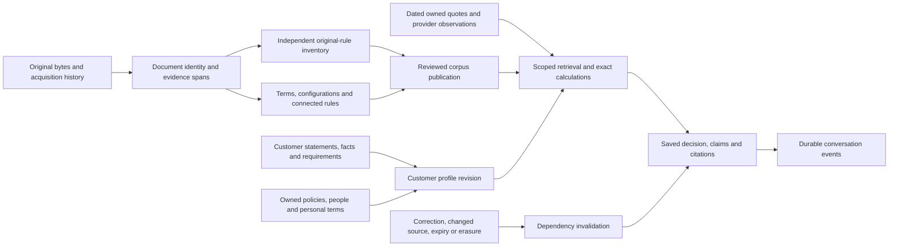

# CoverGuide — database design, revision 10 under staged review

**Approval status: Batches 1 and 2 were explicitly approved by the user on 2026-09-11, and Batch 3 was explicitly approved on 2026-09-12. Remaining batches and the complete design are still under review; nothing has been implemented.** This is the consolidated database proposal, including the field catalogue, relationships, conditional-rule contracts, retrieval operations, lifecycle and migration mapping. It incorporates the current assessment of all 400 cases and nine additional original-derived cases.

The proposal is complete as a reviewable design package for the available evidence. **The original plan's full evidence-and-scenario completion condition is not satisfied:** exact historical document bundles, the corpus-wide independent rule inventory and broader customer decisions remain unfinished. This document does not certify those tasks or waive their place before design approval. Unknown policy information is represented explicitly; it is not filled with invented benefits, eligibility or calculations.

## The design in one view

The application catalogue contains **101 entities, 992 fields, 303 foreign-key relationships and 52 versioned JSON structures**. The separately administered benchmark proposal contains **36 entities, 398 fields and 28 JSON contracts**. These are catalogue sizes, not measures of advice accuracy or insurance coverage.

The design separates customer assertions, public product terms, actual issued cover, preserved originals, conditional rules, observed prices/providers, calculations and saved decisions. Each has different ownership, uncertainty and time semantics. A saved answer pins the exact customer facts, product configuration, corpus revision, calculations and supporting original passages used to produce it.

The [complete ER diagram](complete-entity-relationships.mmd) specifies the full relational graph. The [relationship ledger](relationships.json) gives each FK's target, ownership rule, nullability, deletion/update behavior and proposed enforcement. JSON references use closed target registries and semantic checks; they are not unrestricted table names.

## Every part of the proposal

The [staged human review decisions](design-review-decisions.md) are authoritative for which batches have been approved and which remain open.

| Review question | Authoritative detail |
|---|---|
| How can I review this without database jargon? | [Simple-language review guide with detailed examples and a decision worksheet](SIMPLE_DATABASE_REVIEW_GUIDE.md) |
| Why is information needed? | [28 consolidated requirements](information-requirements.json), distinguishing customer/insurance requirements from operational requirements |
| How does each of the 400 cases contribute? | [Case-to-information and operation map](case-requirement-field-map.json); evaluation entries contain reviewed safe projections only |
| What did additional originals change? | [Nine supplementary cases and exact field targets](additional-case-field-map.json); these remain outside the fixed 200+200 denominator |
| What does every entity do? | [Entity catalogue](entity-catalogue.md), with purpose, access scope, key relationships and links to its fields |
| What does every field mean? | [Readable field dictionary](field-dictionary.md), [typed dictionary](entity-field-dictionary.json), [field traceability](field-traceability-r10.json) |
| What are the physical types and constraint boundaries? | [Storage and constraint contract](storage-and-constraints.md), plus entity-specific constraints and indexes in the dictionary |
| How are rules and arithmetic represented? | [Values and conditional rules](value-and-rule-contracts.md), [52 JSON schemas](json-contracts.schema.json), [worked record examples](worked-record-examples.json) |
| How do records support a customer decision? | [Twelve worked walkthroughs](worked-examples.md), [combi records](combi-worked-records-r6.json), and [operations for every family](retrieval-operations.md) |
| How do corrections, concurrent turns and deletion work? | [Relationships and lifecycle](relationships-and-lifecycle.md) |
| How is evaluation kept independent? | [Separate benchmark proposal](benchmark-storage-proposal.md) and [its complete fields/contracts](benchmark-storage-fields.json) |
| How is the pilot preserved? | [Field-by-field migration map](migration-field-map.json) and [reversible migration/cutover](migration-and-cutover.md) |
| What can the retained stack support? | [Compatibility and qualification](compatibility-and-verification.md); observed versions are dated, and combined runtime qualification remains pending |
| What was checked for this revision? | [Current staged verification](../reports/final-design-verification-r10.json) and [package manifest](../reports/final-design-manifest-r9.json) |

The typed dictionary governs field definitions; the readable dictionary mirrors it. Rule-schema files govern JSON shape, while the value and lifecycle contracts govern cross-record meaning. Entity constraints govern relationships more narrowly than common defaults. Any remaining contradiction blocks the affected implementation until corrected; an implementer must not choose whichever definition is easier. Historical files retain their original revision and are not implicitly reissued as revision 10.

## Records that support the actual customer decision

| Information boundary | Proposed records and behavior |
|---|---|
| Buyer versus insured | Account owns the conversation. Person and PersonRelationship identify the buyer, insured, parent, spouse, child and other relevant roles. A 29-year-old buyer asking for a 63-year-old parent never supplies the parent's eligibility age. |
| Statements, facts and requirements | CustomerStatement preserves meaningful source spans. CustomerFact and CustomerRequirement store reviewed types, values and logical-key correction history. CustomerProfileRevision marks the exact revision pinned by a turn. Unresolved information remains visible and cannot silently become an accepted fact. |
| Public product versus issued policy | Product identifies the family; TermsRevision identifies original-backed terms independently of UIN; Configuration and ConfigurationOption identify selections. PolicyContract, ContractRevision and ContractMember identify actual owned cover. IndividualTerm, CoverageLayer and ContinuityCredit retain personal exceptions and benefit/amount-specific history. |
| Original versus interpretation | OriginalFile preserves bytes. SourceCapture records success or failure; SourceObservation retains the label and link context. DocumentVersion, DocumentPage and EvidenceSpan identify the actual source and location. A filename, successful download or matching UIN does not prove applicability. |
| Grant versus restriction | Rule, RuleEvidence, RuleDependency, RuleIssue and RuleTable/Cell preserve conditions, exceptions, definitions, table selectors and conflicting clauses. Mandatory dependencies load before optional ranked search. |
| Expense versus payment | ExpenseLine and ExpenseAllocation preserve the bill. ClaimLineAssessment distinguishes admissibility, deductible contribution, cover consumption and payment. UsageEntry preserves postings/reversals. ClaimPayment distinguishes actual transactions from corrected assertions about them. |
| Request versus consequence | PolicyEvent and ClaimEvent distinguish local upload, recipient receipt, acceptance, refusal, termination and payment. ClaimDocumentRequirement/Receipt establish the actual necessary-document clock. No record creation sends a cancellation request or terminates cover. |
| Combi wrapper versus components | TermsComponent identifies separately issued slots. ContractBundle, its sealed revisions and members associate exact component policies; insured memberships remain component-specific. An unrelated policy is never swept into package consequences. |
| Price/provider observation versus permanent rule | Quote and components belong to an owner, customer profile revision and configuration. ProviderObservation identifies branch, insurer, service, observation time and validity. A stale quote cannot establish affordability; an incomplete hospital search cannot establish absence. |
| Saved answer versus current truth | Decision, DecisionClaim, ClaimCitation and Calculation retain scope and exact evidence. Artifact, Dependency and ContentCopy track invalidation and copies. A later correction can make the old answer stale without rewriting what it originally said. |

## Rules, values and difficult boundaries

Known zero, unlimited, unknown and not applicable are four distinct quantity states. A limit expressed as a percentage of sum insured keeps both the ratio and the named base; a deductible is not substituted because its number happens to match. Monetary arithmetic uses decimal values and explicit currency, with evidenced order and rounding. Unknown inputs propagate to the dependent result rather than becoming zero.

Waiting periods retain their trigger, units, person, coverage layer and inclusive boundary. Calendar months are not converted into a fixed number of days. A dated amendment can change terms without changing UIN; applicability follows the supported issue/renewal/event predicate, not acquisition time. Endorsements and individual underwriting terms are selected with their exact owner and effective scope.

Limits distinguish person, family, claim, admission, illness, policy year and lifetime. Restoration does not automatically replenish every sublimit. Gross expense, independently admissible expense, prior insurer payment and remaining indemnity are separate inputs. The [walkthroughs](worked-examples.md) show these distinctions, including variant table axes, interacting deductions, benefit pools, waiting credits and claims spanning different periods.

A completed intermediate calculation does not establish final entitlement. The additional claim-clock example can distinguish elapsed days from different receipt events while leaving the actual interest amount unknown when its dated rate or governing convention is missing. The additional combi example can explain a coupled cancellation consequence while leaving actual policy termination and refund unestablished.

## Ownership, history and publication

Private records have immutable nonnull owners. Private relationships enforce matching ownership; mixed public/private evidence also requires a true compatible-scope predicate. Authentication uses the retained Django account/framework structures. RLS and service authorization form separate defenses; privileged maintenance roles are not used for ordinary requests.

Turns persist idempotent work before dispatch. Workers own inference and durable events; SSE reconnect reads events after the saved cursor and does not repeat inference. Fact revision, lease/fencing generation, corpus dependencies and erasure generation are checked before publishing. Cancellation, retry, expired leases, model failure and insufficient evidence have distinct durable outcomes.

Published corpora, snapshots, rules and decision evidence are immutable subject to authorized erasure. A source update creates a new revision and invalidates affected dependencies before atomic publication. Deletion follows originals, extracts, prompts, copies, indexes, cached answers and late worker output; restore-time tombstones prevent resurrection. The lifecycle contract specifies legal holds and explicit verification rather than equating a queued deletion with completion.

The storage contract protects private JSON, indexes, WAL, temporary data, object storage, Redis persistence and backups through encryption at rest with separately controlled keys. It keeps authorized relational queries possible and explicitly treats live privileged administration as a separate access-control boundary. Untrusted readers run without application/benchmark credentials or network egress under a pinned finite resource profile.

The final database review corrected membership serialization, payment-key revision uniqueness, reversal-recipient semantics and event linkage across policy/package targets. Membership mutations now serialize on affected ContractRevision parents; payment-set mutations serialize on the Claim parent. Compatible key-share locks protect referenced identity only. These are proposed protocols awaiting PostgreSQL concurrency tests after approval.

## Assessment and source closure retained with this proposal

| Workstream | Verified current position | Consequence |
|---|---|---|
| Fixed reference cases | 200 individually assessed records across 20 families; all 200 have source follow-ups; 56 calculations retained; 62 follow-ups partially resolve public evidence and 138 leave disposition unchanged | Case requirements are available for design. Full customer decisions are not certified; the 80 follow-ups for reference families 03–10 still need independent re-review. |
| Fixed evaluation cases | Safe assessor export reports 200 individual assessments, 39 completed bounded scopes and 161 broader unresolved scopes | Generalized requirements can inform design. These figures are not adviser passes; no cases are frozen and no three-attempt campaign has run. |
| Legacy reconciliation | 203 identities accounted for: 178 source-backed family findings, three unconfirmed aliases, one unresolved identity and 21 outside the selected roster. All 181 selected-insurer rows have bounded wording candidates | Candidate association does not establish exact historical equivalence. Zero exact historical bundles are complete. The unresolved identity is outside the 181 identified selected-insurer rows. |
| Preserved corpus | 2,942 object hashes verified: 2,466 PDFs and 476 non-PDFs. Current acquisition ledger: 2,725 acquired and 697 failed attempts | Exact bytes and failures are preserved. SourceCapture totals do not measure relevant knowledge coverage. |
| Manual relevance | 352 PDFs have current manual classification; seven retain prior manual assertions, 2,105 are preview-only and two have no earlier preview. Sixteen non-PDFs were manually reviewed; 460 remain unreviewed | Complete relevance classification and page/table/figure/footnote inventory remain unfinished. |
| Independent rules | Candidate original inventories exist, but atomic segmentation and source-scope closure remain unresolved | All insurer knowledge denominators remain unknown; no 90% coverage result is claimed. |
| Independence | Only safe evaluation exports enter this design package; existing exposure is recorded | Shared filesystem separation is insufficient for a frozen independent benchmark. Hard isolation and any required replacement remain prerequisites. |

Of the 2,942 objects, 2,601 have at least one acquired attempt, 328 have preserved failed responses only, and 13 have no acquisition-attempt record. Repeat acquisitions explain why successful attempt counts exceed distinct successfully acquired objects. Failed response bytes remain evidence of access failure, not acquired policy knowledge.

The exact unresolved records are retained in the [source dependency register](../reports/source-completion-dependencies-r22.json), [full corpus accounting](../registers/source-corpus-accounting-r22.json), [latest corpus delta](../registers/source-corpus-delta-r23.json), [reference follow-up casebook](../reference/casebook-r6/README.md), [connected-clause issues](../reports/reference-followup-connected-issues-r6.json) and [safe evaluation summary](../reports/evaluation-safe-summary.json). They remain part of the package's evidence, not exceptions hidden by the design.

## Approval, implementation and acceptance

The design discussion must walk through the entity catalogue, every field, worked decisions, conditional rules/calculations, historical applicability, privacy/corrections/publication and migration mappings. The outcome is an explicitly approved revision. Material later design changes return for discussion. **No approval is inferred from this document, the overall plan or the instruction to finish the proposal.**

After that approval, the implementation order remains: isolated PostgreSQL 18.6 and curated knowledge; backend adviser; strict shared CLIProxyAPI/Codex integration; DRF durable interfaces and streaming; Next.js experience; document readers and independent review; per-insurer discovery and daily updates. Retain Django/DRF, Next.js/TypeScript, Celery/Redis, private original storage and local BGE-M3. Reader processing allows one initial attempt and two targeted retries; unresolved material issues block affected capabilities. Operational version and compatibility choices still require qualification as described in the package.

Acceptance remains **at least 180 of 200 evaluation cases, at least 9 of 10 in every scenario family, with each passing case succeeding on all three independent attempts**. Knowledge requires at least 90% of independently inventoried relevant rule instances overall and for every insurer. All 60 robustness checks are reported separately. Unsupported critical claims, incorrect eligibility, material calculation errors or customer-data leaks block release. Unknown denominators stay unmeasured. The operational-family scoring interpretation must be settled before freeze without lowering these targets or relabeling missing-evidence handling as successful insurance advice.

Verification also covers the original Kota journey, buyer/parent interpretation, corrections, reopening, comparison, citations, cancellation, reconnect and session isolation; calculations, PostgreSQL constraints, API/OpenAPI contracts, CSRF, permissions, worker/relay failures and browser journeys. At five concurrent conversations, measured p95 targets remain under one second for stored retrieval/rule evaluation and under 20 seconds for validated answers without external lookups, with cold/warm, queue, timeout and failure behavior reported.

The migration map covers 188 concrete pilot fields plus inherited/native authentication structures. Unsafe semantic translations remain archived and unresolved. Accounts, password encodings, ownership, messages and original bytes must survive a rehearsed migration and verified rollback. The pilot stays available; production cutover requires separate approval.
