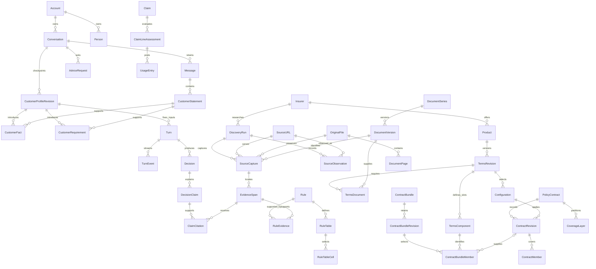

# CoverGuide database proposal — revision 10 under staged review

Start with the [final proposed database design](FINAL_DATABASE_DESIGN.md). It consolidates the available-evidence assessment into a reviewable design package, including every field, entity, relationship, conditional rule, retrieval operation and lifecycle/migration contract. **The full source-and-scenario closure required by the original plan remains unfinished.** No replacement database design is approved and no replacement models or migrations have been implemented. This proposal does not waive the evidence-first sequence.

The application proposal currently contains **101 entities, 992 fields, 303 typed foreign-key relationships and 52 versioned JSON structures**. Batches 1, 2 and 3 are approved; later batches and the complete design remain under review. A separate benchmark-store proposal contains 36 entities, 398 fields and 28 payload structures; its independent administration and hard isolation remain to be implemented after approval. Those counts describe the proposed representation; they are not evidence of scenario success or complete policy knowledge.

## Read the proposal in this order

| Design question | Artifact |
|---|---|
| What did the cases and originals require? | [28 consolidated information requirements](information-requirements.json), [all 400 case-to-requirement/field mappings](case-requirement-field-map.json) |
| What entities exist and how are they related? | [All entity purposes](entity-catalogue.md), overview below, [complete relationship diagram](complete-entity-relationships.mmd), [every relationship and enforcement rule](relationships.json) |
| What does every field mean? | [Field traceability](field-traceability-r10.json), [physical storage/constraints](storage-and-constraints.md), [Readable field dictionary](field-dictionary.md), [complete typed dictionary with units, examples and traceability](entity-field-dictionary.json) |
| How are conditions and calculations represented? | [Values, rules and semantic validation](value-and-rule-contracts.md), [closed JSON structures](json-contracts.schema.json), [source-backed record examples](worked-record-examples.json) |
| How do actual decisions use the records? | [Twelve worked walkthroughs](worked-examples.md), [retrieval operations for all 20 families](retrieval-operations.md) |
| What happens after a correction, source change or deletion? | [Ownership, lineage, worker recovery, publication and lifecycle](relationships-and-lifecycle.md) |
| How are independent cases stored and scored? | [Separate benchmark-store proposal](benchmark-storage-proposal.md), [benchmark fields and payload contracts](benchmark-storage-fields.json) |
| How does the pilot survive replacement? | [Every concrete pilot field mapped](migration-field-map.json), [migration and reversible cutover](migration-and-cutover.md) |
| Is the selected stack compatible and how is it qualified? | [Compatibility and verification sequence](compatibility-and-verification.md), [observed package metadata](dependency-metadata-check.json) |
| What has actually been verified? | [Current staged-design verification](../reports/final-design-verification-r10.json), [current source dependencies](../reports/source-completion-dependencies-r22.json), [database review](../reports/database-proposal-review-r6.json) |

## The central relationships

This is a deliberately smaller orientation diagram. The complete diagram includes every declared FK; JSON references additionally have typed, closed registries and deferred semantic checks. Cardinalities are constrained by the dictionary's uniqueness and lineage rules.

## Why these entities exist

| Area | What the records preserve and why |
|---|---|
| Customer and conversation | Account identifies the owner; Person identifies the insured/buyer without conflating them. PersonRelationship records directional family relationships. CustomerStatement preserves meaningful message spans without copying text. CustomerFact and CustomerRequirement retain structured values and corrections by logical key. CustomerProfileRevision is the small checkpoint pinned by a turn; new conversations start empty because reuse is deferred. |
| Originals and reconciliation | DiscoveryRun records one autonomous Codex search. SourceURL is one address, SourceObservation records each path by which Codex found it, SourceCapture is one preservation attempt and OriginalFile deduplicates exact bytes. DocumentSeries groups a continuing publication while DocumentVersion retains each edition and its dates. DocumentPage accounts for every PDF page and EvidenceSpan locates exact support. LegacyListing preserves the original label while ListingCandidate separately assesses family, variant, observed revision, historical association, bundle completeness and applicability. |
| Product and issued cover | Product is a family, TermsRevision a proposed original-backed edition, Configuration a variant/option selection. TermsDocument links the necessary original bundle. PolicyContract and ContractRevision describe actual owned cover; ContractMember, IndividualTerm, CoverageLayer, ContinuityCredit and PolicyEvent retain personal membership, underwriting, amount layers and history. |
| Combi packages | TermsComponent preserves separately issued product/issuer/version slots. ContractBundle and its sealed revisions/members associate only the actual owned component policies. Different insured memberships, package receipts and coupled consequences remain explicit; referenced life products do not expand the selected medical roster. |
| Rules and arithmetic | Rule, RuleEvidence, RuleDependency and RuleIssue keep conditions, support, connected clauses and conflicts. RuleInventoryItem is the independently inventoried original instance, separate from extraction output. RuleTable/Cell preserve selector axes and footnotes. ExpenseLine/Allocation, ClaimLineAssessment and UsageEntry distinguish gross bill, admissibility, threshold contribution, available cover and payment. Calculation keeps typed inputs, operations, assumptions and results. |
| Changing observations | Provider and Clinician are identities; ProviderObservation is a dated, scoped network/exclusion/accessibility/authorization fact. Quote and QuoteComponent belong to an owner, customer profile revision and precise configuration. Observed prices or hospital status never become timeless policy rules. |
| Saved answers and retrieval | Decision and DecisionClaim retain scoped outcomes; ClaimCitation resolves their originals. CorpusRevision/Member/Pointer pin published knowledge. SearchChunk is a replaceable derivative. Artifact, Dependency and ContentCopy track validity and copies so corrections, source changes and erasure invalidate dependent results. |
| Processing and operations | Turn, Outbox and TurnEvent make work durable before dispatch and reconnectable without another inference. ModelRoute/Qualification/Attempt expose actual model identity and failure. ProcessingJob, CoverageReport and ReviewRecord keep recovery and independent review explicit. Consent, deletion, holds and audit records retain authorized lifecycle evidence. Native Django authentication/session tables and LegacyMapping support preservation. |
| Independent benchmark | The separate-store proposal keeps questions, oracles, exposure, frozen case versions, all three attempts and scoring under independent administration. Only reviewed generalized information requirements and safe reports may leave it for implementation. |

The exact purpose, type, nullability, default, bounds, units, allowed values, relationships, validation, example availability and requirement basis are recorded for every field in the JSON dictionary. Authentic public examples link to preserved original hashes/locations. Account, patient and generated database identities use explicitly synthetic or unavailable examples; no real customer data was inspected for this design.

## Evidence that changed this proposal

The source work requires six independent reconciliation dimensions. A current source can establish a product family and printed UIN while leaving its association to the historical legacy listing unresolved. Several documents have matching family names but different UIN revisions; CMS attachment labels can disagree with the actual PDF; one URL can serve new bytes. These observations require append-only acquisition/link records and explicit conflicts rather than a single product PDF field. [Source reconciliation r5](../reports/source-reconciliation-r5.md)

Original tables require their own selectors. In the Star source, Silver and Gold use different selector meanings; a numeric cell without its column heading and footnotes can produce the wrong answer. Room-related deductions require the percentage base, limit period, expense categories and operation order. The available evidence supports some exact intermediate calculations but leaves final entitlement unresolved. The worked examples preserve that distinction. [Worked examples](worked-examples.md)

The conversation cases require buyer-versus-insured identity, corrected facts, concurrent turn fencing, selective reuse, dated quotes and historical evidence dependencies. A correct saved answer can become stale after a correction or source change. Erasure must follow copies, prompts, caches, indexes and worker results, with restore-time tombstones preventing resurrection. These are separately traced operational requirements, not claimed insurer clauses. [Lifecycle](relationships-and-lifecycle.md)

## Evidence closure that remains unresolved

All 200 reference records and 200 independently assessed replacement evaluation records have individual available-evidence dispositions, conversation steps, requirements and judging criteria. **Zero full customer insurance decisions or adviser successes are claimed.** The canonical reference set contains 56 calculation records, with 48 earlier and eight further independently reviewed results. Its 139 distinct exact passages resolve to five originals and 40 physical pages. Evaluation exports report 39 completed bounded scopes and 161 broader scopes with unresolved dependencies. Complete branch handling is not complete advice. [Reference casebook](../reference/casebook-r5/README.md), [safe evaluation summary](../reports/evaluation-safe-summary.json)

Nine additional original-derived cases sit outside the fixed 200+200 denominator. They cover table axes, image amendments, same-UIN term changes, restoration limits, benefit pools, room limits, claim-document clocks, interacting co-payments and combi cancellation. The [supplementary field map](additional-case-field-map.json) links them to specific proposed fields. All 200 canonical cases now have bounded source follow-ups: 62 partially resolved public-source assessments and 138 unchanged. The [follow-up casebook](../reference/casebook-r6/README.md) preserves the original cases and 56 calculations; 80 distinct added/reread regions resolve to 21 originals and 70 physical pages. The 80 follow-ups for reference families 03–10 (ref-03-01 through ref-10-10), out of the 200 follow-ups, have author verification; independent re-review remains outstanding. No case is replaced merely to fit a newly found document.

All 203 legacy identities are accounted for: 178 source-backed family findings, three unconfirmed aliases, one unresolved identity and 21 outside the selected roster. The 181 selected-insurer rows comprise the 178 family findings and three unconfirmed aliases; the unresolved identity is not an identified selected-insurer row. All **181 selected-insurer rows now have bounded contractual-wording candidates**, including the recovered iHealth original. **Zero exact historical bundles are complete.** The dependency register retains every row, all eight original roles, source evidence, historical attempts and remaining work. All 20 insurers remain in scope, including the four with no legacy rows. [Source dependencies r22](../reports/source-completion-dependencies-r22.md)

The frozen r22 scan verified all **2,942 preserved objects** and accounted for 3,420 acquisition attempts: 2,725 acquired and 695 failed. Of 2,466 PDFs, 352 have current manual relevance classification, seven retain earlier manual assertions, 2,105 remain preview-only and two have no earlier preview. Of 476 non-PDF objects, 16 were manually reviewed and 460 remain unreviewed. Thirteen imported objects still lack acquisition-attempt records, with the known legacy import distinguished from unresolved provenance. Relevance classification is not a full page/table/figure/footnote/connected-rule inventory. **Every insurer's relevant-rule denominator remains unknown.** [Full corpus accounting](../registers/source-corpus-accounting-r22.json)

The object and attempt totals measure different things: 2,601 distinct objects have at least one acquired attempt, 328 additional objects have preserved failed responses only, and 13 have no attempt record (2,601 + 328 + 13 = 2,942). The 2,725 acquired attempts include repeat retrievals of the same bytes. Failed response bytes remain preserved without becoming acquired policy documents.

Two subsequent NPPA acquisition failures increase the current attempt total to 3,422 (2,725 acquired, 697 failed), with no new original. All 2,942 object hashes were checked again. [Current corpus delta](../registers/source-corpus-delta-r23.json)

Source-derived discussion revision 6 adds the combi representation after the supplementary case exposed the gap. Review identified event-stage, membership-sealing and duplicate-underlying-policy issues; the [correction record](../reports/combi-review-corrections-r6.json) and [review](../reports/database-proposal-review-r6.json) preserve their status. The earlier follow-up revision passed 44 focused structural, source, preservation and JSON checks; current revision-7 results are recorded separately. Earlier 223 structural checks and 18 combi probes remain historical verification. These checks do not execute PostgreSQL constraints or establish complete insurance semantics. The historical [author recheck](../reports/combi-author-recheck-r6.json) covered the three prior findings and explicit refusal/refund-reversal events. The final database reviewer subsequently checked sealing, underlying-policy uniqueness and those event consequences. Revision 7 also corrects membership concurrency, payment revision/recipient definitions and policy/package event-link wording; current verification records their document-level recheck. [Current package verification](../reports/design-package-delta-verification-r6.json), [combi contract checks](../reports/combi-contract-verification-r6.json)

Evaluation isolation is also unfinished. The replacement cases are handled by a separate assessor, but the shared filesystem is not a hard access boundary. Exposure is recorded, no cases are frozen, and no three-attempt campaign has run. The operational-family scoring interpretation must be resolved without changing the fixed 180/200 and 9/10-per-family targets or counting missing-evidence handling as successful insurance advice. [Benchmark protocol](benchmark-storage-proposal.md)

## Mandatory discussion boundary

The completed proposed package is ready for detailed discussion. The original/case completion condition remains unmet and must not be inferred from this document. The user discussion must cover every entity/field, worked decision, conditional rule/calculation, version boundary, privacy/correction/publication behavior and migration mapping. The resulting revision requires explicit approval before replacement models, migrations or schema-dependent application implementation. Approval of the overall plan does not approve this database design. Material later changes return for discussion. Production cutover is a separate approval.

The final proposal makes the complete proposed representation inspectable. Completing the design document does not complete the outstanding insurance research or authorize implementation.
