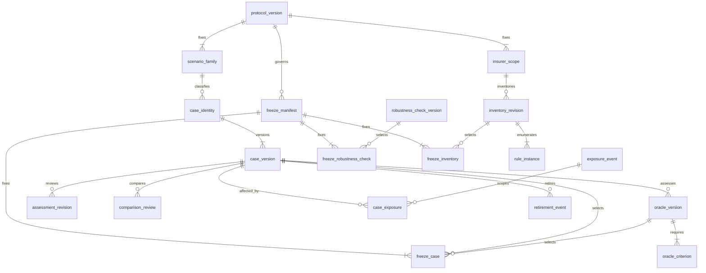
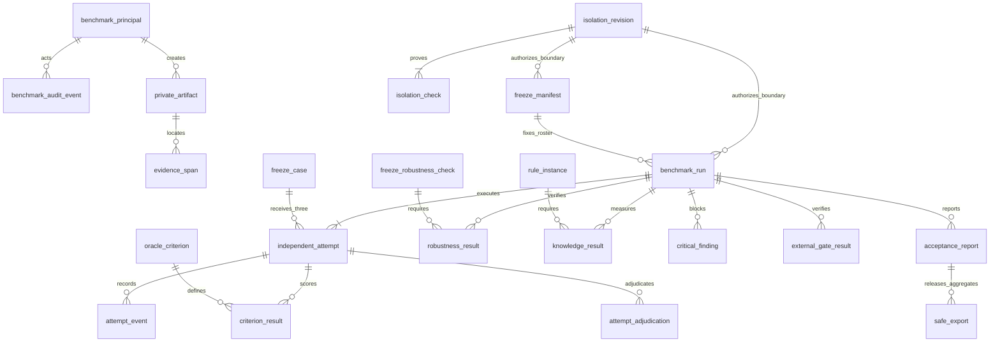

This is a proposed independent benchmark store for design discussion. It defines storage and acceptance procedures; it creates no database, service, accounts, migration or frozen benchmark. Approval of the overall CoverGuide plan does not approve this design. Production cutover remains a separate decision.

The companion [field dictionary](benchmark-storage-fields.json) contains **36 entities, 398 fields and 28 versioned payload contracts**. Every database field records its purpose, type, required/null status, default, allowed values, units, validation, references and classification. Each entity records its purpose, uniqueness, cross-record constraints, indexes and requirement traceability. All fields inherit that traceability. These requirements derive from the independent-assessment and acceptance obligations, principally `OPS-05`, with ownership/privacy under `OPS-01` and verification/migration under `OPS-06`. No actual evaluation question, customer fact, answer, calculation result or source selection appears in either proposal file.

**Storage and authority must be separate before freeze.** The benchmark service needs an independently administered deployment, dedicated database instance, private object storage, queue, credentials, encryption keys, logs and backups. Its database must be physically separate from the application's database. A separate virtual machine qualifies only if implementation accounts cannot administer its host, read its volumes or snapshots, or obtain its credentials. A folder, worktree, schema, named database or container on an implementation-accessible host does not establish this boundary. The current shared filesystem does not satisfy it.

The isolation review also covers the candidate adviser deployment used in evaluation. Questions necessarily reach that runtime, so its messages, logs, request capture, caches, model traces, queues and backups must remain inside independently controlled test infrastructure. Benchmark content must never enter production customer storage, shared retrieval indexes, implementation prompts or tuning datasets. Configuration and access probes use synthetic sentinels, not live benchmark content. The custodian records the tested principal set and exact configuration revision; changes to grants, administration, logging, storage, routing or credentials invalidate the relevant verification.

| Role | Permitted access | Boundary |
|---|---|---|
| Custodian | Private versions, exposure, approved protocol and freeze actions | Independently administered identity and authorization; cannot approve a new database design on the user's behalf |
| Assessor | Originals, private cases, oracles, comparisons and assessment revisions | Must be independent of implementation and parser output used as purported ground truth |
| Executor | Only the selected question, fixture and next scripted action | No oracle, scoring criteria or expected result; no cross-attempt conversation state |
| Scorer | Frozen oracle, exact attempt evidence and independent scoring procedure | Cannot use the candidate's self-assessment as ground truth or alter execution history |
| Safe exporter | Approved aggregate view and closed export payloads | No direct read of private question/oracle/response/evidence-selection tables |
| Auditor | Explicitly authorized private audit scope | No implicit implementation affiliation or unrestricted downstream export |

Human benchmark stewardship may remain with the user. It must use distinct access credentials from implementation sessions. Granting an implementation agent a custodian credential would invalidate the boundary even if the underlying database were separate.

The entity relationships below omit repetitive author and artifact edges for readability; all foreign keys, including self-revision links, are specified in the dictionary.

Every entity has an opaque UUID and a database observation timestamp. Timestamps do not establish commit order: version numbers and durable event sequences do. Private payloads live in encrypted immutable artifacts; the database stores an opaque storage key, ciphertext checksum and private keyed content commitment. Raw case-content hashes and storage keys cannot enter safe exports. Original document bytes may retain their acquisition checksum and provenance privately. External application identities and corpus references are pinned opaque observations, not foreign keys into the production database.

| Entity | Purpose |
|---|---|
| `benchmark_principal` | Authorize benchmark actors independently of application accounts. |
| `protocol_version` | Freeze the unchanged acceptance denominators and evaluation procedure. |
| `scenario_family` | Identify the original family roster without encoding case solutions. |
| `insurer_scope` | Identify every insurer required for separate knowledge coverage. |
| `private_artifact` | Retain immutable private inputs, oracles, source copies, traces and public-export candidates in isolated storage. |
| `evidence_span` | Resolve precise original-backed assertions with surrounding context. |
| `isolation_revision` | Record a tested physical and access-control boundary before freeze. |
| `isolation_check` | Retain individual denial and legitimate-access probes. |
| `case_identity` | Track an opaque case lineage independently of changing content. |
| `case_version` | Version the exact private question, customer fixture and multi-turn script. |
| `oracle_version` | Keep independently established expected findings, calculations and acceptable alternatives private. |
| `oracle_criterion` | Define observable per-step and final assertions without exposing them to the adviser. |
| `assessment_revision` | Preserve what was examined, completed and left unresolved without overwriting prior assessments. |
| `exposure_event` | Record actual or potential access to protected questions, solutions or answer-like metadata. |
| `case_exposure` | Bind an exposure event to every conservatively affected case version. |
| `retirement_event` | Retire exposed or superseded content while preserving replacement lineage. |
| `comparison_review` | Record complete question-only semantic comparison against fixed reference/retired snapshots. |
| `freeze_manifest` | Commit the exact independent cohort, protocol, oracles, inventory and isolation before execution. |
| `freeze_case` | Bind a manifest to exact case and oracle versions and an unchanged family denominator. |
| `robustness_check_version` | Version an independently authored robustness behavior check outside advice scoring. |
| `freeze_robustness_check` | Bind each of the sixty robustness checks to its exact version. |
| `inventory_revision` | Preserve independent original-based relevant-rule denominators per insurer. |
| `rule_instance` | Represent one independently inventoried relevant rule occurrence with exact original support. |
| `freeze_inventory` | Select exact independent insurer denominators before evaluating extraction coverage. |
| `benchmark_run` | Pin the adviser build, corpus, model and environment for one acceptance campaign. |
| `independent_attempt` | Persist exactly three fresh independent attempts for every frozen case. |
| `attempt_event` | Retain durable step, transport, model and response evidence without repeating inference on reconnect. |
| `criterion_result` | Store immutable independent scoring of each required criterion per attempt. |
| `attempt_adjudication` | Commit the exact scoring snapshot and keep behavior correctness distinct from advice success. |
| `robustness_result` | Record each separate robustness check outcome without affecting advice denominators. |
| `knowledge_result` | Evaluate each independent rule instance against the frozen adviser corpus. |
| `critical_finding` | Block release for material correctness/privacy incidents independently of aggregate pass rates. |
| `external_gate_result` | Reference separately verified engineering, journeys, performance and migration gates for the same candidate. |
| `acceptance_report` | Store a reproducible immutable aggregate computed from exact scoring revisions. |
| `safe_export` | Publish only a validated whitelisted aggregate or opaque requirement map. |
| `benchmark_audit_event` | Retain append-only control-plane history without retaining erased private content in logs. |

Case identity survives revisions and retirement. A version fixes the customer input, actors, conversation, fixture and explicit synthetic stipulations. An oracle version fixes findings, acceptable alternatives, required information, exact evidence dependencies, independent calculations and criteria for that exact question version. An assessment revision records what has been established and what remains unresolved. None of these objects can overwrite a version already referenced by an assessment or run.

A synthetic customer or expressly stipulated arithmetic input does not require an actual customer's schedule. The oracle must distinguish author stipulations from authentic insurer terms and independently resolve any real contractual claim it makes. A completed assessment of an insufficient-evidence branch can establish the expected safe response without establishing a complete insurance decision. `completion_scope`, `material_evidence_complete` and `advice_success_eligible` remain separate. Supported negative decisions can qualify as advice when fully established; positive recommendations are not mandatory. Clarification and evidence-limited successes cannot be relabeled successful substantive policy advice. Operational customer-journey scoring is an explicit unresolved discussion decision, described below.

Original evidence uses immutable bytes plus physical-page, text, bounding-box or table-cell locators and connected clauses. Printed page labels are separate from physical page numbers. A calculation oracle carries typed inputs, the expression tree, order, scope, rounding, assumptions, expected result and independent verification. Decimal quantities preserve units and percentage bases. Zero, unlimited, unknown and not applicable are distinct states. An unknown contractual parameter cannot silently become a number. The expression vocabulary is a typed arithmetic/calendar/Boolean tree, never executable Python, SQL or an unrestricted expression string.

The 28 payload contracts in the dictionary describe the proposed required keys, variants and validation obligations. They are design contracts, not implemented JSON Schema validators. Their future implementation must use closed discriminated schemas, reject unknown keys and incompatible versions, and validate every nested reference. Required keys have no inferred defaults; optional absent values remain absent or explicitly unknown. A material contract change requires a new version and review. Fixture events are limited to named isolated operations; they cannot contain arbitrary shell commands, SQL or production targets.

**Exposure and retirement preserve the history.** A detected exposure records when it happened, when it was detected, the recipient class, affected surface, certainty, private evidence and disposition. Exposure can concern questions, oracles, answers embedded in metadata, or unverified access. An affected case-version mapping determines which versions are blocked. No assertion that a field was “question-only” overrides its actual content. Retiring a version records the reason and replacement lineage. Replacement questions and oracles need their own substantive review; renamed people or changed amounts alone do not establish independence or distinctness. Old exposed records remain retired, outside all current acceptance rosters.

**A scoring interpretation requires our discussion before freeze.** The original target requires at least 9 of 10 passing cases in every family, including the operational family. Permanently setting every operational case to `advice_success_eligible=false` would make that target mathematically impossible. Counting a safe insufficient-evidence response as successful substantive policy advice would also misrepresent the requirement.

The proposed interpretation distinguishes a **complete scoped customer journey**, judged against the case's originally authored operational outcome, from a **complete supported policy decision**. Both would remain separately reported. Operational success could enter the unchanged acceptance numerator only if the user explicitly approves this interpretation and every independently established criterion passes in all three attempts. A missing-evidence policy question cannot be reclassified as an operational journey after the fact. The `scoring_interpretation` field defaults to `unresolved`, with a required human decision artifact before protocol approval, freeze or a passing report. This proposal does not resolve that choice, change the 180/200 or 9/10 thresholds, or claim any current attempts or passes; both current counts remain zero.

Freeze proceeds only after that decision, approval and implementation of the design, and verification of the independent deployment:

1. Fix the acceptance protocol, scorer procedures, failure handling, timing measurements and candidate qualification requirements before observing results. The original cohort stays 200 reference cases and 200 evaluation cases across the original 20 families, with ten per family per set and at least four substantively reviewed compound cases per family per set.
2. Independently review every exact question and oracle version. Record concrete conversation steps, known/unknown/corrected facts, evidence dependencies, calculations, alternatives, missing evidence and pass/fail criteria. Resolve uncertainty about the expected behavior itself. Preserve evidence-limited advice eligibility as false. Do not replace a missing central policy finding with a generic answer merely to mark a record complete.
3. Finish semantic and compound review against the current reference question snapshot, retired questions and other proposed evaluation questions. A question or comparator revision invalidates the old review. The separate reference cohort attestation verifies its distribution and compound review without importing reference solutions.
4. Resolve relevant exposure findings and verify access controls for the exact deployment configuration. Existing shared files do not constitute a qualified frozen set. No benchmark material is moved by this proposal.
5. Bind the manifest to exactly 200 evaluation case/oracle pairs, 60 independently specified robustness checks and the independently inventoried relevant-rule scope for all 20 insurers. The complete acceptance manifest requires established denominators; partial preparation may be retained as a draft. Unknown denominators remain unmeasured.
6. Validate and publish the immutable roster atomically in a short transaction. Record the custodian, protocol, isolation revision, private commitment and freeze time. A later material case, oracle, comparator, protocol, exposure or scope change requires invalidation/review and a new manifest. Do not edit a failing case out of an active campaign.

Being in a frozen roster does not itself mean a case passes. All 200 slots remain in the acceptance denominator, including cases whose correctly assessed branch is ineligible. The unresolved operational-family interpretation must be resolved before freeze; this proposal does not present a permanently impossible per-family gate as settled. Any remaining evidence-limited policy branch remains ineligible for substantive success and stays visible in the denominator.

Each campaign pins the candidate build, corpus revision, model identity and qualified procedure. It allocates three attempts per frozen case: **600 independent attempts** for a complete campaign. Each gets a fresh conversation and fixture state. Independence means no previous attempt's transcript, answer, cache derived from the case, scorer feedback or oracle is available to the next attempt. It does not mean silently changing the candidate between attempts. Order and reset procedures are committed before execution.

Persist the attempt and dispatch identity before sending work. A reconnect or duplicate dispatch resumes the same durable attempt; it cannot create a fourth favorable trial. Streamed events carry monotonic sequence numbers and retain partial output, failures, cancellation and timing. A lost connection is not a new inference instruction. Technical failures, cancelled attempts and missing results stay visible. A repaired candidate gets a new campaign; old failed trials remain attached to the old candidate. An infrastructure-invalidated campaign may be rerun under the declared procedure but cannot yield a passing release report by selecting favorable attempts across runs.

Independent scoring appends criterion results and an attempt adjudication. Each scoring revision names its exact observed artifacts, frozen criterion, scorer identity and prior revision. It cannot alter the original response. Disputed scoring may be corrected with an auditable rationale and new report revision; the answer or oracle cannot be silently rewritten to make a result pass. Critical findings remain independently visible even if an aggregate report is recomputed.

| Acceptance gate | Required evidence and exact rule |
|---|---|
| Advice | A case passes only when all three independent attempts pass every required criterion under the explicitly approved scope interpretation. At least 180 of 200 cases must pass, with at least 9 of 10 in every original family. Supported policy decisions, operational journeys and behavior-only results are separately reported; evidence-limited handling cannot become successful policy advice. |
| Knowledge | Correctly represented relevant rule instances divided by the independently inventoried relevant instances, at least 90% overall and for each of the 20 insurers. Use integer comparison `correct * 100 >= total * 90`; do not round percentages into a pass. Missing, incorrect and unreviewed instances remain in the denominator. Unknown/partial denominators are unmeasured. |
| Robustness | All 60 frozen checks pass, reported separately from the 200 advice cases. Missing, technical or unscorable outcomes cannot pass. |
| Critical correctness | Unsupported critical claims, incorrect eligibility, material calculation errors and customer-data leaks block the affected candidate regardless of aggregate scores. Suspected findings block pending adjudication; a confirmed finding requires a corrected candidate and new relevant verification. |
| Customer and engineering journeys | Evidence tied to the same candidate verifies the required original customer journeys, calculation/constraint/API checks, permissions and CSRF, worker/relay recovery, frontend and browser journeys. |
| Performance | At five concurrent conversations, p95 stored retrieval/rule evaluation is strictly below 1,000 ms and validated answers without external lookups strictly below 20,000 ms. Preserve the predeclared sample plan and quantile method; report cold/warm behavior, queue time, timeouts and failures. Validated-answer time includes waiting from durable acceptance to validated availability. |
| Migration | Same-candidate rehearsal proves account/password/ownership/message/original preservation and rollback. These records do not authorize production migration or cutover. |

Knowledge inventory starts from independently reconciled original products, versions, pages, tables, figures, footnotes and connected clauses. Each relevant rule instance has an immutable identity and supporting spans. The parser's extracted rule list cannot supply its own denominator. Unknown product/version scope prevents a complete denominator even if every downloaded file was parsed. Results map frozen original rule instances to candidate corpus representations and record missing, incorrect, unreviewed and operational failures distinctly.

The acceptance report is derived from an immutable snapshot of selected result revisions, not manually entered pass counters. It retains all 200 case slots, all three attempt slots, all 20 insurer denominators, all 60 robustness checks and all critical/external gates. It may report blocked or unmeasured results while work is incomplete. `ready_for_cutover_discussion` requires every gate and is never permission to deploy.

**Only approved safe exports cross back to implementation.** The exporter accepts a closed schema for aggregate progress, aggregate acceptance, the opaque case-to-general-requirement map and the generalized requirement crosswalk. The map allows only an opaque case key, original family number, general requirement IDs and retrieval-operation categories. It excludes customer facts, questions, values, expected outcomes, selected sources, transcripts, case commitments and retirement/replacement lineage. Aggregate status is derived inside the private service and released only after structural and disclosure validation. No per-case pass/failure feedback or queryable private search endpoint is proposed. Repeated adaptive reports need custodian review so aggregate differences do not become a case-specific tuning channel.

Database constraints enforce primary keys, scalar foreign keys, enumerations, positive revisions, uniqueness and ranges. Cross-record checks additionally enforce exact version agreement, non-cyclic supersession, same-run result ownership, role independence, complete criteria, roster cardinality and result provenance. Array-valued references need explicit deferred reference validation; PostgreSQL does not enforce member foreign keys automatically. The proposed service must lock the relevant parents or use serializable transactions to prevent concurrent validation races. Network/model calls run outside these transactions. Role revocation and source/exposure invalidation block subsequent dispatch and publication immediately.

Artifacts and linked records use restrictive deletion and audited retention states. Content erasure removes or cryptographically erases authorized private bytes, including the applicable backups and caches, while retaining non-content tombstones and historical result provenance. An erased dependency makes replay unavailable; the service cannot claim the evidence still resolves. Audit messages use opaque identifiers and reason codes, avoiding question text, passwords, keys, customer data and erased payloads. Expired execution credentials and object download grants do not remain usable because an old report exists.

Proposed indexes support exact identity/version lookup, immutable roster membership, run/attempt ordinal, event sequence, result revision, exposure by case and artifact dependency access. There is no implementation-accessible BM25 or semantic index over benchmark questions, answers or private evidence choices. Before implementing the approved revision, validate every declared cross-record constraint and access probe against the selected PostgreSQL deployment; the dictionary describes requirements rather than claiming they already execute.

The current deliverable is this reviewable proposal and its field dictionary. It establishes no new freeze, independence qualification, adviser score, rule-coverage percentage or release approval.
