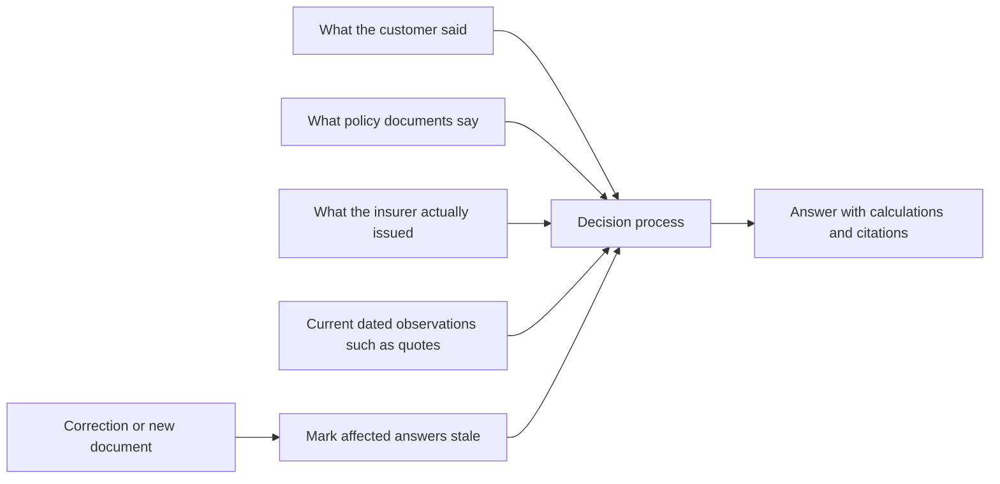

# CoverGuide database design in simple language

This guide explains the proposed CoverGuide database as a business system. It is written for a detailed human review. You do not need to know Django, PostgreSQL or database terminology to use it.

The proposal is not approved or implemented. Examples are fictional and explain storage behavior; they are not insurance advice or expected claim settlements.

## How to use this guide

Review one part at a time. For each part, decide:

- **Accept:** this is the information CoverGuide should remember.
- **Change:** the idea is needed, but the proposed separation or behavior is wrong.
- **Remove:** CoverGuide should not store this information.
- **Question:** you need a worked example or a field-level explanation before deciding.

The easiest review order is:

1. Read the end-to-end example below.
2. Review the eleven data areas.
3. Review the difficult examples.
4. Use the checklist near the end to record decisions.
5. Open the technical field dictionary only when you want to inspect an individual field.

This guide explains all 100 application entities and the separate 36-entity evaluation database. The [complete field dictionary](field-dictionary.md) remains the authority for all 1,020 application fields, their types, defaults and validation.

## The whole system in one picture

CoverGuide needs to answer a question such as:

> “I am buying insurance for my father. He has diabetes. Which policies could apply, what should I ask the insurer, and what can you prove from the original documents?”

To answer safely, the database must join four different kinds of truth:

The database deliberately keeps these truths separate. A customer statement is not an insurer document. General product wording is not a personally accepted policy. A quotation is not permanent product information. A calculated maximum is not proof that a claim was paid.

## A complete example: buying cover for a father with diabetes

Assume a fictional customer, Asha, starts this conversation:

> “I am 31 and want health insurance. I have diabetes.”

Later she clarifies:

> “The policy is for my father Ravi, age 63. I do not have diabetes. Ravi has diabetes and takes tablets.”

### Step 1: keep the people separate

The database creates:

- one `Account` for Asha's login;
- one `Person` for Asha;
- one `Person` for Ravi;
- one `PersonRelationship` saying Ravi is Asha's father;
- a separate intended-insured fact saying the proposed cover concerns Ravi.

It does not copy Asha's age or health information to Ravi. The relationship “father” also does not prove that Ravi is accepted as a policy member. Family relationship and insurance membership are different things.

### Step 2: preserve the correction

The first statement about diabetes is stored as a `CustomerFact` sourced from Asha's first message. The clarification creates new assertions:

- Asha: diabetes assertion corrected to false or “earlier attribution was wrong,” according to what she explicitly confirms;
- Ravi: diabetes diagnosis/treatment assertion;
- Ravi: age 63 as reported, without inventing a date of birth;
- Ravi: intended insured person.

The old statement is not erased. It is linked to its correction. A `CustomerProfileRevision` then records exactly which accepted facts are current for the next answer.

Why keep the old statement? If an answer was produced before the correction, CoverGuide must be able to show that it used the earlier information and must mark that answer stale.

### Step 3: identify possible products

For each candidate, CoverGuide separates:

- `Insurer`: the legal insurance company;
- `Product`: the product family;
- `PolicyVersion`: the exact edition of the legal terms;
- `ProductVariant`: the selected variant and combination;
- `ProductOption`: a rider, add-on or election.

A product can remain:

- applicable;
- possibly applicable but missing information;
- excluded by a supported rule; or
- unsupported because CoverGuide lacks the governing evidence.

“Senior plan” in a product name is not enough. CoverGuide must find the exact entry-age rule, the applicable edition and the relevant configuration.

### Step 4: load the full rule, not a marketing sentence

Suppose a product page says “diabetes covered,” while the policy documents describe:

- eligibility subject to underwriting;
- a pre-existing-disease waiting period;
- an optional chronic-care benefit;
- a disease-specific co-pay in an individual offer;
- exclusions or treatment-setting conditions.

Each structured statement is stored as a `PolicyRule` with `PolicyRuleEvidence`. `PolicyRuleLink` connects rules that must be read together. Conflicting passages are retained with a contradiction role and the parent rule stays blocked until the conflict is resolved.

### Step 5: distinguish an illustration from an issued offer

CoverGuide may explain this fictional arithmetic:

> If an admissible diabetes claim were ₹100,000 and an accepted disease-specific co-pay were 20%, the customer share would be ₹20,000 before any other applicable operation.

That is a `Calculation`, not a claim prediction. The answer remains conditional until CoverGuide sees the actual offer or endorsement establishing:

- that the 20% applies to Ravi;
- which diabetes expenses it covers;
- what amount the percentage uses as its base;
- where it occurs in the calculation order;
- whether Ravi accepted it.

An actual issued offer becomes a `CustomerPolicy` and `CustomerPolicyRevision`. Its private PDF is a `CustomerUploadedDocument`. Ravi becomes a `PolicyMember` only when membership is evidenced, and a purchased add-on becomes a `CustomerPolicyOption`. Personal underwriting terms are reviewed in Batch 6. General product wording cannot overwrite issued evidence.

### Step 6: save an answer that can be checked later

The answer is stored as a `Decision`. Each important statement becomes a `DecisionClaim`, for example:

- “Ravi, rather than Asha, is the intended insured person.”
- “Entry-age eligibility remains conditional on the exact product edition.”
- “Diabetes treatment may be subject to a waiting period and personal underwriting.”
- “The 20% arithmetic is illustrative until the accepted endorsement is available.”

Each policy statement has a `ClaimCitation` pointing to an exact `EvidenceSpan`. The decision also records the customer profile revision, product terms, rules, calculations and unresolved information it used.

If Asha later corrects Ravi's age, uploads an issued schedule or CoverGuide discovers a conflicting amendment, `Dependency` records which conclusions are affected. The original answer remains in history but becomes stale for current use.

That is the central design: preserve what was known, what was assumed, what was proved and what later changed.

---

## Part 1: accounts, people and conversations

### Why this area exists

Health-insurance questions often mix the buyer, proposer, payer, insured person, spouse, parent and child. CoverGuide must know who each fact concerns.

| Record | Simple meaning | Example |
|---|---|---|
| `Account` | Logical login implemented by Django `User(AbstractUser)` | Asha's account |
| `AIPreference` | The user's separately stored qualified AI route choice | Asha selects an approved route |
| `Person` | One human described by that account | Asha and Ravi are separate people |
| `PersonRelationship` | A dated relationship between people | Ravi is Asha's father |
| `Conversation` | One continuing customer discussion | “Health cover for father” |
| `Message` | One immutable user or adviser message | Asha's correction about diabetes |
| `ConversationMessageChunk` | Replaceable lexical/semantic index for an exact part of a long message | Locate an old spouse-addition passage without loading the full chat |
| `AdviceRequest` | What the customer is trying to achieve | Buy new cover for Ravi with a stated budget |

Important choices to review:

- A person belongs to the account, but one conversation does not automatically use every fact from every other conversation.
- A relationship does not mean policy membership.
- Messages are preserved as submitted. Redaction is recorded rather than quietly rewriting history.
- The customer's objective is separate from facts. “I need no co-pay” is a requirement, not evidence that a candidate has no co-pay.

## Part 2: statements, facts, requirements and revisions

### Why a fact is not stored as one editable profile field

If the database stored only `father_has_diabetes = true`, it would lose who said it, when they said it, whether it was accepted, and what it corrected.

| Record | Simple meaning | Example |
|---|---|---|
| `code-controlled FactType registry` | The definition of a fact type | “diagnosis,” “residence,” or “intended insured” |
| `CustomerFact` | One statement with subject, source and certainty | “Ravi takes diabetes tablets,” reported by Asha |
| `CustomerProfileRevision` | The exact set of facts accepted at one conversation revision | Facts used for answer revision 4 |
| `deferred cross-conversation reuse` | Permission to reuse selected facts in another conversation | Reuse Ravi's age, but not an unrelated disclosure |

Every assertion keeps:

- who or what it concerns;
- what was said;
- its value and units;
- where it came from;
- when it was true or observed;
- when CoverGuide recorded it;
- whether the customer confirmed it;
- which earlier assertion it corrects;
- whether the value is known, uncertain or conflicting.

### Example: age without a date of birth

If Ravi says “I am 63,” CoverGuide can store reported age 63 at the message date. It must not invent a birth date such as 1 January 1963. An entry-age calculation needing an exact birthday remains unresolved until the date is supplied or the rule permits an age-only answer.

### Example: two unresolved medicines

If a customer first says “one blood-pressure tablet” and later says “maybe two,” both statements remain visible. A confirmed correction reuses the same fact logical key; an ambiguous second statement remains clarification-required and cannot silently replace the first.

## Part 3: original documents and exact citations

### Why URL, file and policy document are different records

A URL can fail today and work tomorrow. It can redirect. It can later serve different bytes. A downloaded PDF can have a misleading filename. The same PDF can appear through several official links.

| Record | Simple meaning | Example |
|---|---|---|
| `DiscoveryRun` | One autonomous Codex search for an insurer | A session looking for all Care documents |
| `SourceURL` | One unique public web address | An insurer download URL |
| `SourceObservation` | One path through which Codex found a URL | A search result and a product-page attachment pointing to the same URL |
| `SourceCapture` | One attempt to preserve the URL's current content | Failed on Monday, succeeded on Tuesday |
| `OriginalFile` | Exact preserved bytes identified by their hash | The PDF actually received |
| `DocumentSeries` | One continuing publication across editions | Care Supreme Policy Wording |
| `DocumentVersion` | One dated or labelled edition | The 2025 wording with printed UIN X |
| `DocumentPage` | A physical page and its review state | Physical page 7, fully reviewed |
| `EvidenceSpan` | The exact text/table area supporting a statement | Room-rent row plus header and footnote |
| `PolicyVersionDocument` | A document's role in one terms edition | This PDF is the contractual wording |

### Example: changed bytes at the same URL

Suppose `insurer.example/policy.pdf` produced file A in January and file B in June. CoverGuide stores two source captures and two exact byte hashes. It never overwrites A with B and calls B the historical document.

### Example: a table cell needs its header

A cell containing “3,00,000” proves little by itself. The citation must also retain:

- the row, such as robotic surgery;
- the column, such as ₹10 lakh sum insured;
- the unit and period;
- relevant footnotes;
- continuation-page context.

This is why `EvidenceSpan` and `PolicyRuleTableCell` remain separate records. The table axes and result meaning live in the parent `PolicyRule.body`.

## Part 4: products, versions, variants and options

### The identity ladder

| Level | Meaning | Example |
|---|---|---|
| `Insurer` | Legal company | A fictional insurer |
| `Product` | Product family | “Health Secure” |
| `PolicyVersion` | One legal edition | Edition issued in 2026 |
| `ProductVariant` | One base variant and its allowed choices | Gold with ₹5–50 lakh available SI |
| `ProductOption` | One available optional or mandatory addition | Chronic-care add-on |

Old catalogue records remain in migration evidence and are not live replacement application models.

### Why UIN alone is insufficient

The same UIN can appear with changed terms or different named variants. Therefore CoverGuide keeps UIN, terms edition, byte hash, configuration and applicability separately.

### Example: an amendment at renewal

A policy begins in 2023. A 2024 amendment changes the maximum waiting period at renewal while preserving earlier continuity credit. CoverGuide creates a new `PolicyVersion`. It selects the revision using the supported renewal rule and date. It does not reset continuity merely because a new document was downloaded.

## Part 5: actual policies and individual terms

Product information says what may be offered. These records say what the customer actually owns.

| Record | Simple meaning | Example |
|---|---|---|
| `CustomerUploadedDocument` | One private file supplied by the customer | Ravi's uploaded policy schedule |
| `CustomerPolicy` | Stable identity of an insurer-issued policy or personal offer | Ravi's policy number and insurer |
| `CustomerPolicyRevision` | Exact selections and dates applying to one issued revision | ₹10 lakh Gold cover valid this year |
| `PolicyMember` | One person actually covered by that revision | Ravi covered from 1 October |
| `CustomerPolicyOption` | One add-on selection for that revision | Maternity add-on selected and verified |
| `CustomerPolicyFact` | One sourced fact about the issued cover, using a controlled type and typed value | 20% diabetes co-pay for Ravi, a ₹2 lakh enhancement, or 24 months of continuity on the first ₹5 lakh |
| `PolicyEvent` | One sourced event in the policy timeline | Renewal due, request received, cancellation accepted |

### Example: enhancement has a different waiting clock

Suppose Ravi ports ₹5 lakh with 24 months of accepted continuity and increases cover by ₹2 lakh. The old ₹5 lakh and new ₹2 lakh become separate `CustomerPolicyFact` records. Continuity may apply fully to the first layer and not to the enhancement. One `wait_completed = true` flag would be wrong.

### Example: cancellation is a sequence, not a checkbox

CoverGuide distinguishes:

1. customer asks a question;
2. customer submits a cancellation request;
3. insurer receives it;
4. insurer accepts or refuses it;
5. coverage terminates on an evidenced date;
6. refund is calculated;
7. refund is paid and received;
8. a payment reversal, if any, occurs separately.

Creating a `PolicyEvent` explains observed state. It never sends a request to the insurer or cancels a policy.

## Part 6: combi products containing separate policies

A combi product can package health and life insurance while keeping them as separate legal policies with different insurers, members and benefits.

| Record | Simple meaning |
|---|---|
| `TermsComponent` | A public slot such as health component or life component |
| `ContractBundle` | The customer's stable package identity |
| `ContractBundleRevision` | One sealed interpretation of the package membership |
| `ContractBundleMember` | The exact owned policy filling one component slot |

### Detailed example

Meera owns a new two-component package:

- Health component covers Meera and Arjun.
- Life component covers Meera alone.
- Meera also owns an older unrelated health policy.

The wrapper says a free-look request for either component affects the whole package. The database therefore records:

- two public component slots;
- two actual component policy revisions;
- Meera and Arjun as members only of the health policy;
- Meera as the life insured;
- the old health policy outside this package;
- the wrapper rule affecting both package members.

If Meera asks to cancel only the life component, CoverGuide can explain the supported package consequence. It cannot mark either policy cancelled, infer a refund, or affect the unrelated old policy.

The package revision is sealed with a member digest. Once sealed, component membership cannot be quietly appended or changed. A correction creates another revision.

## Part 7: policy rules, conflicts and tables

| Record | Simple meaning |
|---|---|
| `PolicyRule` | One reviewed condition, benefit, limit, exclusion or calculation instruction |
| `PolicyRuleEvidence` | Exact source passages supporting, defining, restricting or contradicting it |
| `PolicyRuleLink` | Another policy rule that must be loaded with it |
| `PolicyRuleTableCell` | One indexed table result; the parent rule defines its rows, columns, units and scope |

### Rules use three-valued logic

A condition may be true, false or unknown.

Example:

- `Ravi has diabetes` = true.
- `Ravi selected the chronic option` = unknown.
- Rule requires both.
- Final applicability = unknown, not false.

Unknown information cannot be converted into a convenient answer.

### Conflicting source example

If a detailed wording says 36 months and its own summary says four years, CoverGuide links both passages, marks one as contradicting the other and keeps the `PolicyRule` blocked. The detailed review finding is retained by the later general review record.

### Table-selector example

One variant may select a procedure limit using deductible; another may use sum insured. The same number in two columns does not make them interchangeable. A table lookup must supply every required axis exactly once. Missing or overlapping cells return unknown or conflict.

## Part 8: quantities, limits and calculations

`Calculation` stores a deterministic expression, exact inputs, assumptions, result, intermediate trace and verification identity.

### Four states that must never be mixed

| State | Meaning | Example |
|---|---|---|
| Zero | The value is known to be exactly zero | Established ₹0 co-pay |
| Unknown | The amount has not been established | Current premium unavailable |
| Unlimited | This rule imposes no limit | No room-category cap under this rule |
| Not applicable | This rule does not apply to this situation | Maternity rule for an unrelated claim |

“Up to sum insured” is not unlimited. It is a formula using the selected finite sum insured.

### Money and percentages

CoverGuide stores exact decimal amounts and a currency. Five percent is a ratio of `0.05` and must identify its base.

These are different:

- 20% of the gross hospital bill;
- 20% of the admissible amount;
- 20% of one disease category;
- 20% after a deductible;
- 20% before a deductible.

If the source does not establish the order, CoverGuide retains alternative calculations and says why the final amount is unknown.

### Detailed room-rent example

Fictional inputs:

- Base sum insured: ₹100,000.
- Bonus layer: ₹10,000.
- Room rule: lower of 2% of base SI or ₹5,000 per day.
- Three room days.
- Surgeon: ₹80,000.
- Medicines: ₹20,000 and outside the proportional reduction.
- Co-pay: 5% after admissibility.

The daily room allowance is 2% of ₹100,000 = ₹2,000. The ₹10,000 bonus does not change that base.

| Step | ₹2,000 room | ₹4,000 upgraded room |
|---|---:|---:|
| Gross room cost | ₹6,000 | ₹12,000 |
| Gross total | ₹106,000 | ₹112,000 |
| Allowed room | ₹6,000 | ₹6,000 |
| Allowed surgeon after room rule | ₹80,000 | ₹40,000 |
| Medicines | ₹20,000 | ₹20,000 |
| Admissible subtotal | ₹106,000 | ₹66,000 |
| 5% customer co-pay | ₹5,300 | ₹3,300 |
| Conditional insurer amount | ₹100,700 | ₹62,700 |
| Customer balance | ₹5,300 | ₹49,300 |

The upgraded room increases the customer's exposure by ₹44,000 in this illustration, even though the room itself costs only ₹6,000 more. The design stores the original expenses, affected allocations and each calculation step so this consequence is visible.

## Part 9: treatment expenses and coverage calculations

The approved Batch 9 records stop four different numbers from being collapsed into one:

1. what the hospital billed;
2. what this insurer considers admissible;
3. what counts toward a deductible or policy limit;
4. what the policy is expected to pay under the stated assumptions.

| Record | Simple meaning |
|---|---|
| `TreatmentEpisode` | The medical event, independent of an insurance claim |
| `TreatmentExpense` | One billed service or item |
| `TreatmentExpense.allocations` | Exceptional structured portions inside one expense; it is a field, not another model |
| `CoverageAssessment` | One treatment evaluated against an issued policy revision or a prospective product selection |
| `Calculation` | Exact inputs, ordered arithmetic, assumptions and result |
| `ExpenseCoverageResult` | Admissibility, deductible contribution, cover use and expected payable amount for one expense |

Expected payable amount does not establish that an insurer approved or transferred money. Actual claim submission, insurer events, required documents, cumulative usage and payments remain pending for Batch 10.

### Preview of the pending actual-claim review

Fictional chronology:

- 1 August: customer submits the claim.
- 5 August: customer uploads documents to the adviser.
- 7 August: insurer receives the last necessary document.
- 26 August: insurer pays ₹100,000.

These are separate events. An upload to CoverGuide does not prove insurer receipt.

From 1 August to 26 August is 25 elapsed calendar days. From 7 August to 26 August is 19 days. A policy may use one date for settlement time and the other for delayed-payment interest.

The exact interest remains unknown if the governing external rate, day-count method or rounding convention is unavailable. CoverGuide can preserve the known elapsed periods without inventing the final amount.

### Correction and reversal example

If an insurer payment was recorded as ₹100,000 and later evidence proves ₹90,000:

- create a corrected `ClaimPayment` revision sharing the logical payment key;
- preserve the ₹100,000 historical assertion;
- reverse and repost affected `UsageEntry` accounting safely;
- invalidate calculations and answers using the old amount.

A correction is not a bank reversal. An actual refund or recovery is a separate evidenced transaction with its actual sender and recipient.

## Part 10: quotes, hospitals and changing observations

| Record | Simple meaning |
|---|---|
| `Quote` | A dated private offer for exact people, facts and product selection, including its price breakdown and payment schedule |
| `ProviderLocation` | Exact hospital or healthcare-facility branch |
| `ProviderNetworkSnapshot` | One dated insurer directory/list with its filters and completeness |
| `ProviderNetworkEntry` | One exact branch's network, restricted or excluded status in that snapshot |

### Quote correction example

A quote is obtained using the wrong residence. When the customer corrects the residence, the old quote remains historical but cannot be used as a current price comparison. Unknown tax or fees remain unknown, not zero.

### Hospital example

“City Hospital” may have three branches. A network listing for one branch does not cover all three. “Not found in our search” also does not prove non-network status unless the search source and scope were complete. Network, excluded-provider status, cashless authorization and policy coverage are separate conclusions.

## Part 11: retrieval, saved answers and change tracking

| Record | Simple meaning |
|---|---|
| `CorpusRevision` | One immutable published knowledge set |
| `CorpusMember` | Exact term/rule revisions inside that set |
| `CorpusPointer` | Which published set is currently active |
| `SearchChunk` | A replaceable search copy linked back to originals |
| `Artifact` | Stable identity of an input or output |
| `Dependency` | A link showing that one result depends on another item |
| `Decision` | The complete saved outcome for exact inputs |
| `DecisionClaim` | One independently checkable statement in the outcome |
| `ClaimCitation` | Exact original evidence for one statement |
| `Calculation` | A reproducible arithmetic result and trace |

### Retrieval happens in two layers

First, CoverGuide loads mandatory rules through exact relationships: applicable terms, definitions, exceptions, tables, footnotes and known conflicts. Second, text/vector search finds supporting passages. Search ranking may improve citation order, but it cannot discard a mandatory exclusion or repair a missing rule.

### Example: a new amendment appears

Suppose decision D used terms revision T1. A newly acquired amendment creates T2 and a review finds it applicable to the customer's renewal date.

- D remains a historical record of what was answered using T1.
- Its dependency on T1 is preserved.
- Current validity becomes stale or blocked.
- A new answer uses T2 after publication.
- CoverGuide never edits D to pretend it originally used T2.

## Part 12: durable work, model calls and document processing

| Record | Simple meaning |
|---|---|
| `Turn` | One durable unit of customer work |
| `TurnEvent` | Ordered progress/output events used when reconnecting |
| `Outbox` | Work or events committed for reliable later delivery |
| `ModelRoute` | One exact configured model route, without credentials |
| `ModelQualification` | Evidence that a route supports the required schemas/capabilities |
| `ModelAttempt` | One actual model call, including failure, latency and usage |
| `ProcessingJob` | A resumable document reading, extraction or review job |
| `ReviewRecord` | An independent review with a defined scope |

### Example: browser connection drops

The user submits one message. CoverGuide stores the message, statements, fact/requirement revision, turn and outbox work before starting inference. If the browser disconnects, reconnecting reads saved `TurnEvent` rows after the last cursor. It does not send the model request again.

### Example: a correction arrives while a model is working

The old worker may finish, but before publishing it must recheck the expected fact revision. If the customer corrected a material fact, the result cannot publish as current. The new turn uses the corrected customer profile revision.

### Model routing rule

The database records requested model, configured route, actual upstream identity, schema version, latency, usage and explicit failure. It does not silently switch models or hide a retry. Credentials live outside these records.

### Untrusted document rule

PDFs and web content are treated as untrusted data. Reader workers receive only the selected input, have no application or benchmark credentials, and have no network access. Resource limits cover bytes, page expansion, pixels, time and memory. A reader limit or failed page becomes an explicit incomplete result, not a successful document.

## Part 13: independent rule inventory and knowledge coverage — later quality-store review

The application must prove how much original insurance material it represents. It cannot let the parser count its own output and call that coverage.

This section is outside the approved customer-advice application schema. Its later review must represent:

- each occurrence found by independent original reading;
- the sealed source scope and counting method;
- inclusion, exclusion, structural and unresolved dispositions;
- split, merge and qualifier lineage;
- independent judgment that an approved policy rule represents a counted occurrence;
- reproducible numerator, denominator and measured or unmeasured status.

The quality store may use several internal records to enforce those boundaries. Their exact models and fields have not yet been approved.

### Example: one printed cell, many configurations

A table may print “up to sum insured” across eight sum-insured columns. The inventory must decide whether that is one printed occurrence, eight configuration consequences, or both at different levels. It records the decision and lineage instead of changing the count invisibly.

If atomic segmentation or relevant source scope is unresolved, the denominator remains unknown. CoverGuide cannot publish “90% covered” until a sealed inventory and reviewed support set make that percentage reproducible.

## Part 14: privacy, permissions and deletion

| Record | Simple meaning |
|---|---|
| `ConsentRecord` | Specific authorization and later revocation |
| `DeletionRequest` | The requested erasure scope and workflow state |
| `RetentionHold` | An approved, bounded exception to deletion |
| `ContentCopy` | Where private content was copied or transformed |
| `AuditEvent` | Minimal record of who performed an authorized operation |

Existing Django access records are preserved:

- `AuthGroup`
- `AuthPermission`
- `AccountGroup`
- `AccountPermission`
- `GroupPermission`
- `AuthSession`
- `ContentType`
- `AdminLogEntry`

These are compatibility records for login, sessions and administration. They do not create insurance meaning.

### Ownership rule

Every private row has an owner. A private row can refer only to compatible public data or private data belonging to the same owner. Database row-level security is a second protection, not a replacement for application authorization.

### Selective deletion example

A customer asks to remove one medical disclosure.

1. Increase the account's erasure generation so old workers cannot publish it again.
2. Find the source assertion and every `ContentCopy` or dependent artifact.
3. Remove or redact it from messages, customer profile history, model payloads, search derivatives, caches and saved answers.
4. Preserve unrelated facts.
5. Mark affected historical answers non-replayable where their evidence is gone.
6. Apply tombstones before restored backups become accessible.
7. Keep the request failed or held until every required storage location is verified.

The system does not null the owner field to turn private data into public data.

Private database files, indexes, WAL, temporary data, object storage, Redis persistence and backups use encryption at rest with separately controlled keys. This protects stolen storage; it does not prevent a privileged live administrator from reading data. Authorization and restricted administration remain necessary.

## Part 15: migration from the current pilot

| Record | Meaning |
|---|---|
| `LegacyMapping` | Exact old table/key, preserved payload, new target and mapping status |

The migration proposal maps 188 concrete pilot fields and preserves native authentication structures.

Safe migration means:

- keep account UUIDs and complete encoded password values;
- preserve ownership and message order;
- preserve original bytes and hashes;
- archive any field that cannot be translated safely;
- do not turn old free-form profile JSON into confirmed medical facts;
- do not treat a matching name or UIN as proof of an exact terms edition;
- preserve deleted-data tombstones;
- rehearse rollback without losing messages written after cutover.

The pilot remains available until acceptance and rollback are verified. Production cutover is a separate decision.

## Part 16: the separate evaluation database

The 200 evaluation cases and their expected answers must not be available to the implementation or tuning process. They live in a physically separate database and private object store under separate administration and credentials.

The 36 proposed records fall into six understandable groups.

### A. Independent people and protocol

| Record | Meaning |
|---|---|
| `benchmark_principal` | An independently authorized benchmark actor |
| `protocol_version` | The fixed scoring rules and unchanged denominators |
| `scenario_family` | One of the 20 scenario families |
| `insurer_scope` | One insurer whose knowledge coverage is measured separately |

### B. Private cases and expected answers

| Record | Meaning |
|---|---|
| `private_artifact` | Encrypted private question, oracle, fixture or trace |
| `evidence_span` | Exact private original support |
| `case_identity` | Stable opaque case lineage |
| `case_version` | Exact question, customer facts and conversation script |
| `oracle_version` | Expected findings, alternatives, calculations and evidence |
| `oracle_criterion` | One observable pass/fail requirement |
| `assessment_revision` | What the independent assessor completed or left unresolved |

“Oracle” means the independently established expected result used to score the adviser. The adviser must never see it.

### C. Isolation, exposure and freezing

| Record | Meaning |
|---|---|
| `isolation_revision` | The tested physical/access boundary |
| `isolation_check` | One legitimate-access or denial test |
| `exposure_event` | Actual or possible access to protected material |
| `case_exposure` | Cases affected by that exposure |
| `retirement_event` | Removal of an exposed/superseded version from future rosters |
| `comparison_review` | Independent semantic comparison with reference/retired cases |
| `freeze_manifest` | Exact immutable campaign roster and protocol |
| `freeze_case` | One exact case/oracle membership in that roster |

An exposed case is retired from the current acceptance roster and replaced through substantive independent review. Renaming the customer or changing amounts is not enough.

### D. Independent knowledge and robustness material

| Record | Meaning |
|---|---|
| `robustness_check_version` | One independently authored non-advice behavior check |
| `freeze_robustness_check` | Exact version included among the 60 checks |
| `inventory_revision` | Independent insurer-rule denominator |
| `rule_instance` | One relevant original-backed rule |
| `freeze_inventory` | Exact insurer inventory used in the campaign |

### E. Campaign execution and scoring

| Record | Meaning |
|---|---|
| `benchmark_run` | One candidate build, corpus, model and environment |
| `independent_attempt` | One of exactly three attempts for a frozen case |
| `attempt_event` | Durable attempt events without repeating inference |
| `criterion_result` | Result for one expected behavior |
| `attempt_adjudication` | Final scoring revision for one attempt |
| `robustness_result` | Outcome of one robustness check |
| `knowledge_result` | Whether one inventoried rule is represented correctly |
| `critical_finding` | A correctness/privacy defect that blocks release |
| `external_gate_result` | Engineering, journey, performance or migration evidence |
| `acceptance_report` | Reproducible aggregate release result |

### F. Controlled output and audit

| Record | Meaning |
|---|---|
| `safe_export` | An approved aggregate or opaque requirement-only export |
| `benchmark_audit_event` | Minimal independent control history |

The application side may receive general information requirements and final aggregate results. It may not receive questions, customer fixtures, expected answers, selected evidence or per-case feedback.

## Why there are many records

The 100 application entities are not 98 independent features. Most exist because two facts that look similar have different meaning or lifecycle.

Examples:

- URL versus acquisition attempt versus preserved file.
- Product family versus terms edition versus offered configuration.
- General terms versus the customer's issued contract.
- Gross bill versus admissible amount versus policy usage versus cash paid.
- Customer upload versus insurer receipt.
- Cancellation request versus accepted termination.
- Original answer versus whether it is still current.
- Candidate rule occurrence versus accepted denominator membership.

Combining these pairs would make the database smaller, but it would also make unsupported conclusions difficult to detect.

The trade-off is operational complexity. More records mean more constraints, joins, migrations and tests. The proposal accepts that cost to preserve evidence, uncertainty, history and customer ownership. Your review should decide whether every separation earns its cost.

## Decisions to make during your review

Copy this table into your notes and mark each row.

| Area | Main decision | Accept / Change / Remove / Question | Notes |
|---|---|---|---|
| People and roles | Keep buyer, proposer, payer and each insured person separate |  |  |
| Facts | Preserve sourced assertions and corrections instead of one editable profile |  |  |
| Conversation reuse | Require explicit permission before importing facts into another conversation |  |  |
| Originals | Keep URL, attempt, exact bytes, document identity, page and evidence span separate |  |  |
| Product identity | Keep family, UIN/edition, configuration and options separate |  |  |
| Owned policy | Keep public product terms separate from issued contract and personal terms |  |  |
| Combi | Represent wrapper and component policies separately |  |  |
| Rules | Store conditions, evidence, dependencies, conflicts and tables separately |  |  |
| Unknown values | Distinguish zero, unlimited, unknown and not applicable |  |  |
| Calculations | Preserve inputs, order, assumptions, trace and result |  |  |
| Claims | Separate bill, admissibility, threshold contribution, cover use and payment |  |  |
| Events | Separate upload, receipt, acceptance, refusal, termination and payment |  |  |
| Quotes/providers | Treat them as dated observations with exact scope |  |  |
| Saved decisions | Preserve each claim, citation, calculation and dependency |  |  |
| Corrections | Keep old answers historical and mark current validity separately |  |  |
| Model processing | Persist work before dispatch; never repeat inference on reconnect |  |  |
| Knowledge coverage | Use an independently sealed rule inventory as denominator |  |  |
| Privacy | Enforce owner matching, scoped reuse, encryption and complete copy-aware erasure |  |  |
| Migration | Archive unsafe translations and preserve passwords/sessions/ownership |  |  |
| Evaluation | Keep questions and oracles in a physically separate controlled store |  |  |

## Field-level review: what to check

After accepting or changing the concepts above, use the [readable field dictionary](field-dictionary.md). For every entity, check:

1. **Purpose:** should CoverGuide remember this value?
2. **Subject:** who or what does it describe?
3. **Source:** how does CoverGuide know it?
4. **Time:** when was it true, observed, issued or received?
5. **Uncertainty:** can it be unknown or disputed?
6. **History:** what happens when it changes?
7. **Ownership:** who may read or alter it?
8. **Validation:** what invalid value must the database reject?
9. **Deletion:** what happens when the customer erases it?
10. **Example:** does the example match the intended business meaning?

The [entity catalogue](entity-catalogue.md) is a shorter index of all 100 entities. The [technical storage contract](storage-and-constraints.md) explains database types, locking, encryption and enforcement. The [final proposed design](FINAL_DATABASE_DESIGN.md) records the authoritative scope and approval boundary.

## Questions that deserve special attention

These choices have the greatest effect on cost or behavior:

- Is one active processing turn per conversation correct, or should the product allow several simultaneous questions?
- Should facts ever be reused across conversations by default, or always require a specific grant?
- Is retaining old corrected assertions necessary for every fact type?
- Which retention periods should apply to messages, model attempts, private originals and operational events? The proposal deliberately leaves the actual periods undecided.
- Which staff roles may see customer medical facts, original uploads, model payloads and audit records?
- Is storage-level encryption sufficient for the first implementation, given that a privileged live administrator can still read values?
- Which product changes count as a new terms revision, and who may approve applicability?
- When two official passages conflict, who may resolve the conflict and what evidence is sufficient?
- What should customers see when an earlier answer becomes stale?
- Which benchmark administrators are operationally independent from the implementation team?

## What approval would mean

Approving this design would mean you agree with the proposed information boundaries, records, relationships and lifecycle after requested revisions are incorporated.

It would not mean:

- all insurer documents have been reconciled;
- every policy rule has been inventoried;
- every case has a complete customer answer;
- the database constraints have executed successfully;
- the adviser passed its acceptance target;
- production cutover is approved.

Those require later evidence and separate gates. A material entity, relationship or rule-representation change discovered later returns for discussion.

## Approved Batch 2 simplification

Batch 2 deliberately uses five customer-information tables. `CustomerStatement` points to meaningful spans in the immutable message without copying its text. `CustomerFact` and `CustomerRequirement` store different structured meanings and retain corrections as later versions sharing a logical key. `CustomerProfileRevision` is only a checkpoint; it does not copy memberships. `AdviceRequest` is the customer's continuing goal, while later turns record individual processing attempts.

At revision N, the current profile selects the latest fact and requirement version for each logical key introduced at or before N. Retracted facts and withdrawn requirements are inactive. Multiple terminal values for a scalar person/fact type are a conflict that requires clarification. This removes the former snapshot-membership tables while retaining historical reproduction.
