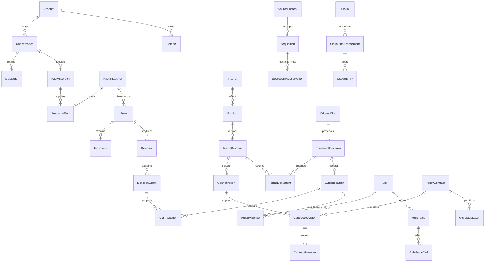

# CoverGuide database proposal — discussion draft 4

This package proposes the database needed by the **400 available-evidence case assessments** and the current original-source reconciliation. It is not yet the final, complete original-derived design requested in the plan: the corpus-wide rule inventory, exact historical bundles and broader customer decisions remain unfinished. **No replacement database design has been approved and no replacement models or migrations have been implemented.** The source and case work must continue before final design approval.

The application proposal currently contains **85 entities, 845 fields, 257 typed foreign-key relationships and 46 versioned JSON structures**. A separately administered benchmark-store proposal is included to preserve evaluation independence. Those counts describe the proposed representation; they are not evidence of scenario success or complete policy knowledge.

## Read the proposal in this order

| Design question | Artifact |
|---|---|
| What did the cases and originals require? | [25 consolidated information requirements](information-requirements.json), [all 400 case-to-requirement/field mappings](case-requirement-field-map.json) |
| What entities exist and how are they related? | Overview below, [complete relationship diagram](complete-entity-relationships.mmd), [every relationship and enforcement rule](relationships.json) |
| What does every field mean? | [Readable field dictionary](field-dictionary.md), [complete typed dictionary with units, examples and traceability](entity-field-dictionary.json) |
| How are conditions and calculations represented? | [Values, rules and semantic validation](value-and-rule-contracts.md), [closed JSON structures](json-contracts.schema.json), [source-backed record examples](worked-record-examples.json) |
| How do actual decisions use the records? | [Nine worked walkthroughs](worked-examples.md), [retrieval operations for all 20 families](retrieval-operations.md) |
| What happens after a correction, source change or deletion? | [Ownership, lineage, worker recovery, publication and lifecycle](relationships-and-lifecycle.md) |
| How are independent cases stored and scored? | [Separate benchmark-store proposal](benchmark-storage-proposal.md), [benchmark fields and payload contracts](benchmark-storage-fields.json) |
| How does the pilot survive replacement? | [Every concrete pilot field mapped](migration-field-map.json), [migration and reversible cutover](migration-and-cutover.md) |
| Is the selected stack compatible and how is it qualified? | [Compatibility and verification sequence](compatibility-and-verification.md), [observed package metadata](dependency-metadata-check.json) |
| What has actually been verified? | [Current package verification](../reports/design-package-verification-r4.json), [source review](../reports/source-design-review-r4.json), [database review](../reports/database-proposal-review-r4.json) |

## The central relationships

This is a deliberately smaller orientation diagram. The complete diagram includes every declared FK; JSON references additionally have typed, closed registries and deferred semantic checks. Cardinalities are constrained by the dictionary's uniqueness and lineage rules.

## Why these entities exist

| Area | What the records preserve and why |
|---|---|
| Customer and conversation | Account identifies the owner; Person identifies the insured/buyer without conflating them. Relationship records roles. FactAssertion records attributed, sourced and corrected assertions; FactPredicate defines their type/cardinality. FactSnapshot and SnapshotFact fix exactly which facts a turn used. Reuse grants make cross-conversation imports explicit. |
| Originals and reconciliation | SourceLocator is a URL; Acquisition is one attempt; OriginalBlob preserves exact bytes. SourceLinkObservation retains every discovery occurrence and conflicting attachment label. DocumentRevision records the original's identity/classification; DocumentPage and EvidenceSpan locate exact evidence. LegacyListing preserves the original label while ListingCandidate separately assesses family, variant, observed revision, historical association, bundle completeness and applicability. |
| Product and issued cover | Product is a family, TermsRevision a proposed original-backed edition, Configuration a variant/option selection. TermsDocument links the necessary original bundle. PolicyContract and ContractRevision describe actual owned cover; ContractMember, IndividualTerm, CoverageLayer, ContinuityCredit and PolicyEvent retain personal membership, underwriting, amount layers and history. |
| Rules and arithmetic | Rule, RuleEvidence, RuleDependency and RuleIssue keep conditions, support, connected clauses and conflicts. RuleInventoryItem is the independently inventoried original instance, separate from extraction output. RuleTable/Cell preserve selector axes and footnotes. ExpenseLine/Allocation, ClaimLineAssessment and UsageEntry distinguish gross bill, admissibility, threshold contribution, available cover and payment. Calculation keeps typed inputs, operations, assumptions and results. |
| Changing observations | Provider and Clinician are identities; ProviderObservation is a dated, scoped network/exclusion/accessibility/authorization fact. Quote and QuoteComponent belong to an owner, fact snapshot and precise configuration. Observed prices or hospital status never become timeless policy rules. |
| Saved answers and retrieval | Decision and DecisionClaim retain scoped outcomes; ClaimCitation resolves their originals. CorpusRevision/Member/Pointer pin published knowledge. SearchChunk is a replaceable derivative. Artifact, Dependency and ContentCopy track validity and copies so corrections, source changes and erasure invalidate dependent results. |
| Processing and operations | Turn, Outbox and TurnEvent make work durable before dispatch and reconnectable without another inference. ModelRoute/Qualification/Attempt expose actual model identity and failure. ProcessingJob, CoverageReport and ReviewRecord keep recovery and independent review explicit. Consent, deletion, holds and audit records retain authorized lifecycle evidence. Native Django authentication/session tables and LegacyMapping support preservation. |
| Independent benchmark | The separate-store proposal keeps questions, oracles, exposure, frozen case versions, all three attempts and scoring under independent administration. Only reviewed generalized information requirements and safe reports may leave it for implementation. |

The exact purpose, type, nullability, default, bounds, units, allowed values, relationships, validation, example availability and requirement basis are recorded for every field in the JSON dictionary. Authentic public examples link to preserved original hashes/locations. Account, patient and generated database identities use explicitly synthetic or unavailable examples; no real customer data was inspected for this design.

## Evidence that changed this proposal

The source work requires six independent reconciliation dimensions. A current source can establish a product family and printed UIN while leaving its association to the historical legacy listing unresolved. Several documents have matching family names but different UIN revisions; CMS attachment labels can disagree with the actual PDF; one URL can serve new bytes. These observations require append-only acquisition/link records and explicit conflicts rather than a single product PDF field. [Source reconciliation r5](../reports/source-reconciliation-r5.md)

Original tables require their own selectors. In the Star source, Silver and Gold use different selector meanings; a numeric cell without its column heading and footnotes can produce the wrong answer. Room-related deductions require the percentage base, limit period, expense categories and operation order. The available evidence supports some exact intermediate calculations but leaves final entitlement unresolved. The worked examples preserve that distinction. [Worked examples](worked-examples.md)

The conversation cases require buyer-versus-insured identity, corrected facts, concurrent turn fencing, selective reuse, dated quotes and historical evidence dependencies. A correct saved answer can become stale after a correction or source change. Erasure must follow copies, prompts, caches, indexes and worker results, with restore-time tombstones preventing resurrection. These are separately traced operational requirements, not claimed insurer clauses. [Lifecycle](relationships-and-lifecycle.md)

## What remains unresolved before the requested final design

All 200 reference records and 200 independently assessed replacement evaluation records have individual available-evidence dispositions, concrete conversation steps, requirements and judging criteria. **Zero full customer insurance decisions or adviser successes are claimed.** There are 50 reference calculation records, including 39 newly independently recomputed results; their hypothetical inputs and missing entitlement dependencies remain explicit. Evaluation exports report 37 completed bounded scopes and 163 broader scopes with unresolved dependencies. Complete branch handling is not complete advice. [Reference assessments](../reference/assessments-200-r4.jsonl), [safe evaluation summary](../reports/evaluation-safe-summary.json)

All 203 legacy identities are accounted for; 178 listing rows have a source-backed family finding, three remain unconfirmed aliases, one identity is unresolved and 21 are outside the selected roster. **Zero exact historical bundles are complete.** For 181 selected-insurer rows, 99 have a contractual-wording candidate and 82 lack an assigned candidate; unassigned does not mean unavailable. The per-listing dependency register distinguishes unperformed corpus work from exact failed access. All 20 insurers remain in scope. [Source dependencies](../reports/source-completion-dependencies-r6.md)

All 2,814 preserved objects passed hash accounting. Of 2,357 PDFs, 128 have r5 manual relevance classification, seven retain earlier manual assertions, and 2,222 remain preview-only. Of 457 non-PDF objects, four were manually reviewed and 453 remain unreviewed. Even relevance-classified documents still require full page/table/figure/footnote/connected-rule inventory. **The relevant rule denominator remains unknown.** These outstanding originals may reveal further requirements and change this proposal. [Full corpus accounting](../registers/source-corpus-accounting-r5.json)

Evaluation isolation is also unfinished. The replacement cases are handled by a separate assessor, but the shared filesystem is not a hard access boundary. Exposure is recorded, no cases are frozen, and no three-attempt campaign has run. The operational-family scoring interpretation must be resolved without changing the fixed 180/200 and 9/10-per-family targets or counting missing-evidence handling as successful insurance advice. [Benchmark protocol](benchmark-storage-proposal.md)

## Mandatory discussion boundary

When the original/case dependencies have been worked through, the user discussion must cover every entity/field, worked decision, conditional rule/calculation, version boundary, privacy/correction/publication behavior and migration mapping. The resulting revision requires explicit approval before replacement models, migrations or schema-dependent application implementation. Approval of the overall plan does not approve this database design. Material later changes return for discussion. Production cutover is a separate approval.

This draft makes the proposed representation inspectable while the remaining evidence work continues; it is not a request to waive that sequence.
